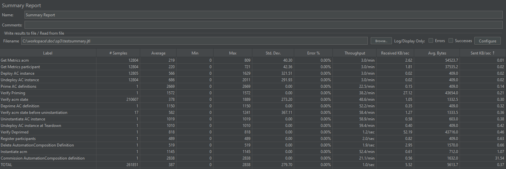
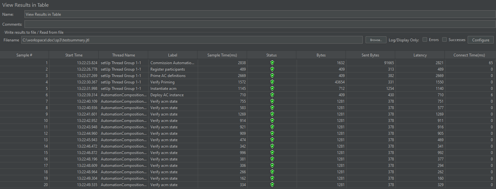
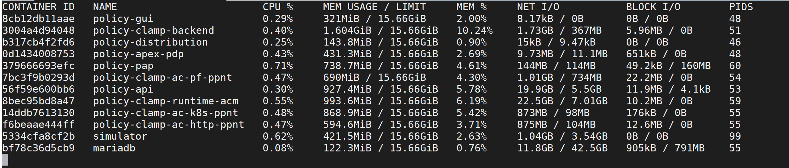
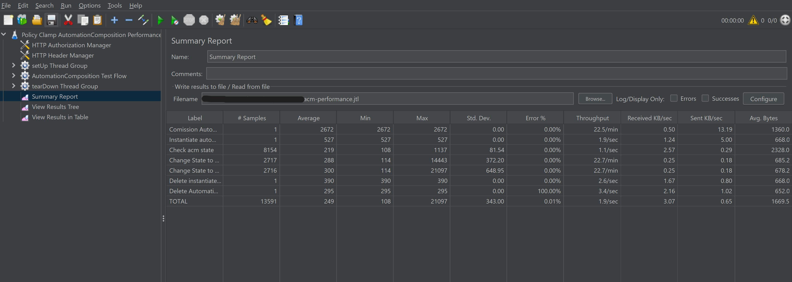

.. This work is licensed under a
.. Creative Commons Attribution 4.0 International License.
.. http://creativecommons.org/licenses/by/4.0

.. _acm-s3p-label:

.. toctree::
   :maxdepth: 2

Policy Clamp Automation Composition
~~~~~~~~~~~~~~~~~~~~~~~~~~~~~~~~~~~

Both the Performance and the Stability tests were executed by performing requests
against acm components installed as docker images in local environment. These tests we all
performed on a Ubuntu VM with 32GB of memory, 16 CPU and 50GB of disk space.

ACM Deployment
++++++++++++++

In an effort to allow the execution of the s3p tests to be as close to automatic as possible,
a script will be executed that will perform the following:

- Install of a microk8s kubernetes environment
- Bring up the policy components
- Checks that the components are successfully up and running before proceeding
- Install Java 17
- Install Jmeter locally and configure it
- Specify whether you want to run stability or performance tests

The remainder of this document outlines how to run the tests and the test results

Common Setup
++++++++++++
The common setup for performance and stability tests is now automated - being carried out by a script in- **testsuites/run-s3p-test.sh**.

Clone the policy-clamp repo to access the test scripts

.. code-block:: bash

    git clone https://gerrit.onap.org/r/policy/clamp

Stability Test of acm components
++++++++++++++++++++++++++++++++

Test Plan
---------
The 72 hours stability test ran the following steps sequentially in a single threaded loop.

- **Commission Automation Composition Definitions** - Commissions the ACM Definitions
- **Register Participants** - Registers the presence of participants in the acm database
- **Prime AC definition** - Primes the AC Definition to the participants
- **Instantiate acm** - Instantiate the acm instance
- **DEPLOY the ACM instance** - change the state of the acm to DEPLOYED
- **Check instance state** - check the current state of instance and that it is DEPLOYED
- **UNDEPLOY the ACM instance** - change the state of the ACM to UNDEPLOYED
- **Check instance state** - check the current state of instance and that it is UNDEPLOYED
- **Delete instance** - delete the instance from all participants and ACM db
- **DEPRIME ACM definitions** - DEPRIME ACM definitions from participants
- **Delete ACM Definition** - delete the ACM definition on runtime

This runs for 72 hours. Test results are present in the **testsuites/automated-performance/s3pTestResults.jtl**
directory. Logs are present for jmeter in **testsuites/automated-performance/jmeter.log** and
**testsuites/automated-performance/nohup.out**

Run Test
--------

The code in the setup section also serves to run the tests. Just one execution needed to do it all.

.. code-block:: bash

    bash run-s3p-test.sh run stability

Once the test execution is completed, the results are present in the **automate-performance/s3pTestResults.jtl** file.

This file can be imported into the Jmeter GUI for visualization. The below results are tabulated from the GUI.

Test Results
------------

**Summary**

Stability test plan was triggered for 72 hours.

**Test Statistics**

=======================  =================  ==================  ==================================
**Total # of requests**  **Success %**      **Error %**         **Average time taken per request**
=======================  =================  ==================  ==================================
260590                    100.00 %           0.00 %              997 ms
=======================  =================  ==================  ==================================

**ACM component Setup**

==============================================  ============================================================    ===========================================
**NAME**                                        **IMAGE**                                                       **PORT**
==============================================  ============================================================    ===========================================
 policy-clamp-runtime-acm-5c6d8fbfb-jz8rb       nexus3.onap.org:10001/onap/policy-clamp-runtime-acm:latest      30007/tcp
 policy-clamp-ac-pf-ppnt-55c4cb99f4-spvng       nexus3.onap.org:10001/onap/policy-clamp-ac-pf-ppnt:latest       30008/tcp
 policy-api-58cb45fc9b-ff5md                    nexus3.onap.org:10001/onap/policy-api:latest                    30002/tcp
 policy-clamp-ac-http-ppnt-7b99cbfbf8-d4w9v     nexus3.onap.org:10001/onap/policy-clamp-ac-http-ppnt:latest     30009/tcp
 policy-clamp-ac-k8s-ppnt-6d854cc8b6-twdkh      nexus3.onap.org:10001/onap/policy-clamp-ac-k8s-ppnt:latest      30010/tcp
 policy-models-simulator-bcd494d87-bfg6g        nexus3.onap.org:10001/onap/policy-models-simulator:latest       30904/tcp
 mariadb-galera-0                               nexus3.onap.org:10001/mariadb:10.5.8                            3306/tcp
 policy-pap-847d89997d-x9h99                    nexus3.onap.org:10001/onap/policy-pap:latest                    30003/tcp
 policy-apex-pdp-0                              nexus3.onap.org:10001/onap/policy-apex-pdp:latest               6969/tcp
==============================================  ============================================================    ===========================================

.. Note::

              .. container:: paragraph

                  There were no failures during the 72 hours test.

**JMeter Screenshot**

**JMeter Screenshot**

**Memory and CPU usage**

The memory and CPU usage can be monitored by running "docker stats" command.

Memory and CPU usage after test execution:

Performance Test of acm components
++++++++++++++++++++++++++++++++++

Introduction
------------

Performance test of acm components has the goal of testing the min/avg/max processing time and rest call throughput for all the requests with multiple requests at the same time.

Setup Details
-------------

We can setup the environment and execute the tests like this from the **clamp/testsuites** directory

.. code-block:: bash

    bash run-s3p-test.sh run performance

This runs for 2 hours. Test results are present in the **testsuites/automate-performance/s3pTestResults.jtl**
directory. Logs are present for jmeter in **testsuites/automate-performance/jmeter.log** and
**testsuites/automated-performance/nohup.out**

Test Plan
---------

Performance test plan is the same as the stability test plan above except for the few differences listed below.

- Increase the number of threads up to 5 (simulating 5 users' behaviours at the same time).
- Reduce the test time to 2 hours.

Run Test
--------

The code in the setup section also serves to run the tests. Just one execution needed to do it all.

.. code-block:: bash

    bash run-s3p-test.sh run performance

Once the test execution is completed, the results are present in the **automate-performance/s3pTestResults.jtl** file.

This file can be imported into the Jmeter GUI for visualization. The below results are tabulated from the Jmeter GUI.

Test Results
------------

Test results are shown as below.

**Test Statistics**

=======================  =================  ==================  ==================================
**Total # of requests**  **Success %**      **Error %**         **Average time taken per request**
=======================  =================  ==================  ==================================
15520                    100 %              0.00 %              464 ms
=======================  =================  ==================  ==================================

**ACM component Setup**

==============================================  ============================================================    ===========================================
**NAME**                                        **IMAGE**                                                       **PORT**
==============================================  ============================================================    ===========================================
 policy-clamp-runtime-acm-5c6d8fbfb-jz8rb       nexus3.onap.org:10001/onap/policy-clamp-runtime-acm:latest      30007/tcp
 policy-clamp-ac-pf-ppnt-55c4cb99f4-spvng       nexus3.onap.org:10001/onap/policy-clamp-ac-pf-ppnt:latest       30008/tcp
 policy-api-58cb45fc9b-ff5md                    nexus3.onap.org:10001/onap/policy-api:latest                    30002/tcp
 policy-clamp-ac-http-ppnt-7b99cbfbf8-d4w9v     nexus3.onap.org:10001/onap/policy-clamp-ac-http-ppnt:latest     30009/tcp
 policy-clamp-ac-k8s-ppnt-6d854cc8b6-twdkh      nexus3.onap.org:10001/onap/policy-clamp-ac-k8s-ppnt:latest      30010/tcp
 policy-models-simulator-bcd494d87-bfg6g        nexus3.onap.org:10001/onap/policy-models-simulator:latest       30904/tcp
 mariadb-galera-0                               nexus3.onap.org:10001/mariadb:10.5.8                            3306/tcp
 policy-pap-847d89997d-x9h99                    nexus3.onap.org:10001/onap/policy-pap:latest                    30003/tcp
 policy-apex-pdp-0                              nexus3.onap.org:10001/onap/policy-apex-pdp:latest               6969/tcp
==============================================  ============================================================    ===========================================

**JMeter Screenshot**

