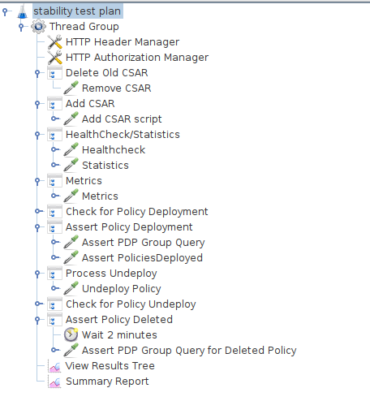
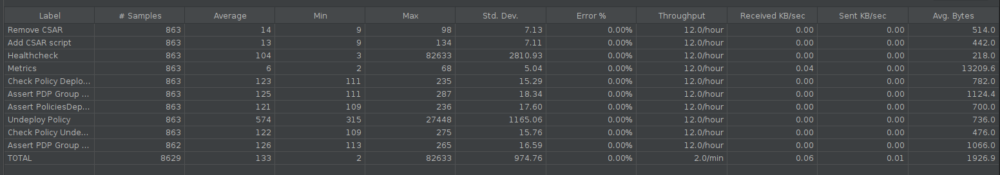
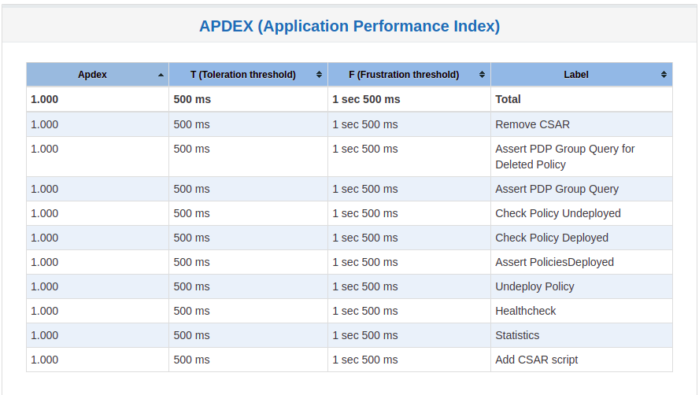
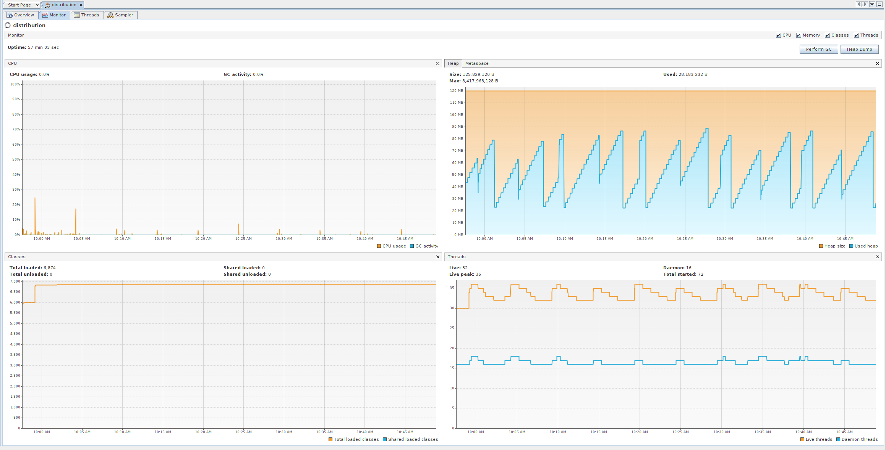
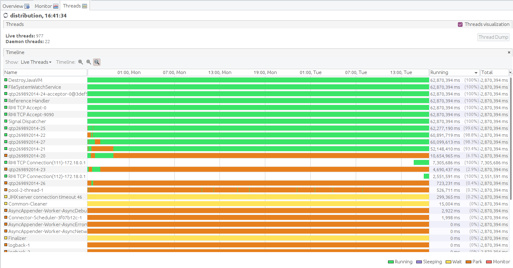
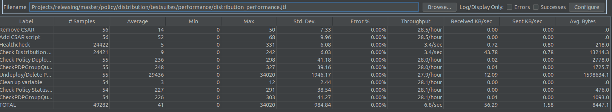
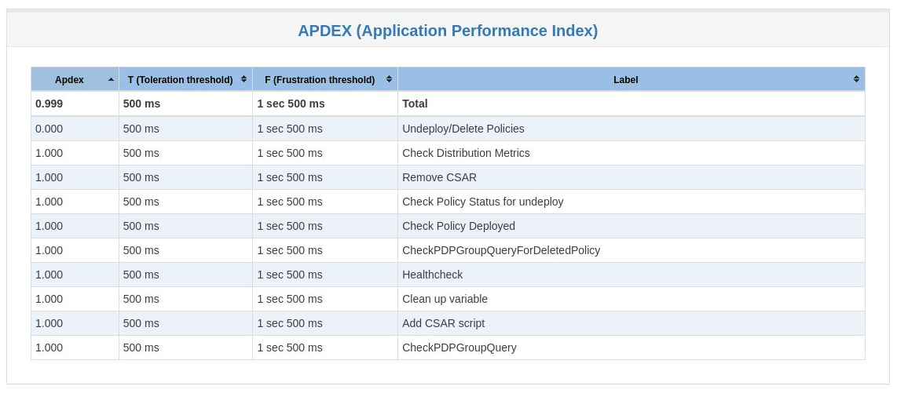
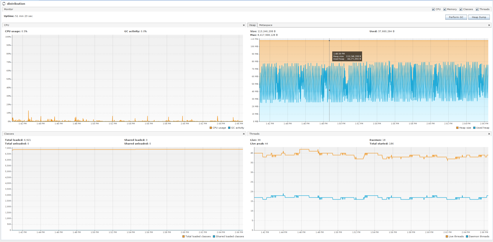
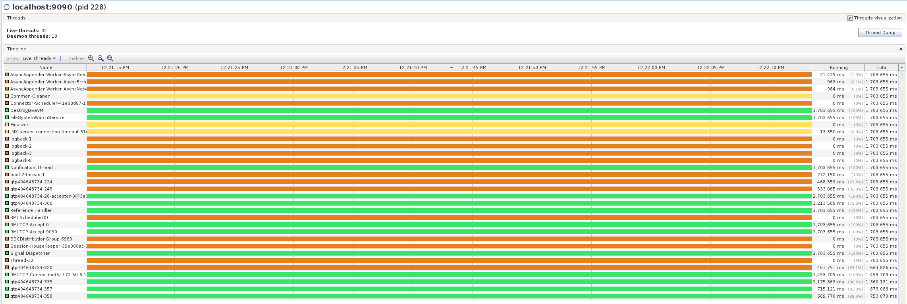

.. This work is licensed under a
.. Creative Commons Attribution 4.0 International License.
.. http://creativecommons.org/licenses/by/4.0

.. _distribution-s3p-label:

Policy Distribution component
#############################

72h Stability and 4h Performance Tests of Distribution
++++++++++++++++++++++++++++++++++++++++++++++++++++++

Common Setup
------------

The common setup for performance and stability tests is now automated - being carried out by a script in- **testsuites/run-sc3-test.sh**.

Clone the policy-distribution repo to access the test scripts

.. code-block:: bash

    git clone https://gerrit.onap.org/r/policy/distribution

**The following common steps are carried out by the scripts**

* Updates the repo package lists for apt
* Installs Java 17 open jdk
* Installs docker
* Installs docker-compose
* Retrieves version information in environment variables from th release info file
* Builds relevant images including the pdp simulator
* Triggers docker compose to bring up containers required for the testing
* Installs jmeter
* Installs visualvm (and starts it in a GUI environment)
* Configures permissions for monitoring
* Starts jstatd
* Waits for containers to come up
* Runs either stability or performance tests for a specified duration depending on the arguments specified

For example, the below runs performance tests for 2 hours. Start from the root directory of policy distribution

.. code-block:: bash

    cd testsuites
    ./run-s3p-test.sh performance 7200

.. note::
    The containers on this docker-compose are running with HTTP configuration. For HTTPS, ports
    and configurations will need to be changed, as well certificates and keys must be generated
    for security.

The script will load up the visualvm GUI on your virtual machine. You will need to manually connect
it to the distribution JMX port.

Connect to Distribution JMX Port.

    1. On the visualvm toolbar, click on "Add JMX Connection"
    2. Enter localhost as the IP address and Port 9090. This is the JMX port exposed by the
       distribution container
    3. Double click on the newly added nodes under "Local" to start monitoring CPU, Memory & GC.

Example Screenshot of visualVM

.. image:: distribution-s3p-results/distribution-visualvm-snapshot.png

Teardown Docker

Once the testing is finished, you can tear down the docker setup from **./testsuites** with:

.. code-block:: bash

    docker-compose -f stability/src/main/resources/setup/docker-compose.yml down

Stability Test of Policy Distribution
+++++++++++++++++++++++++++++++++++++

Introduction
------------

The 72 hour Stability Test for policy distribution has the goal of introducing a steady flow of
transactions initiated from a test client server running JMeter. The policy distribution is
configured with a special FileSystemReception plugin to monitor a local directory for newly added
csar files to be processed by itself. The input CSAR will be added/removed by the test client
(JMeter) and the result will be pulled from the backend (PAP and PolicyAPI) by the test client
(JMeter).

The test will be performed in an environment where Jmeter will continuously add/remove a test csar
into the special directory where policy distribution is monitoring and will then get the processed
results from PAP and PolicyAPI to verify the successful deployment of the policy. The policy will
then be undeployed and the test will loop continuously until 72 hours have elapsed.

Test Plan Sequence
------------------

The 72h stability test will run the following steps sequentially in a single threaded loop.

- **Delete Old CSAR** - Checks if CSAR already exists in the watched directory, if so it deletes it
- **Add CSAR** - Adds CSAR to the directory that distribution is watching
- **Get Healthcheck** - Ensures Healthcheck is returning 200 OK
- **Get Metrics** - Ensures Metrics is returning 200 OK
- **Assert PDP Group Query** - Checks that PDPGroupQuery contains the deployed policy
- **Assert PoliciesDeployed** - Checks that the policy is deployed
- **Undeploy/Delete Policy** - Undeploys and deletes the Policy for the next loop
- **Assert PDP Group Query for Deleted Policy** - Ensures the policy has been removed and does not exist

The following steps can be used to configure the parameters of the test plan.

- **HTTP Authorization Manager** - used to store user/password authentication details.
- **HTTP Header Manager** - used to store headers which will be used for making HTTP requests.
- **User Defined Variables** -  used to store following user defined parameters.

==========  ===============================================
 **Name**    **Description**
==========  ===============================================
 PAP_HOST     IP Address or host name of PAP component
 PAP_PORT     Port number of PAP for making REST API calls
 API_HOST     IP Address or host name of API component
 API_PORT     Port number of API for making REST API calls
 DURATION     Duration of Test
==========  ===============================================

Screenshot of Distribution stability test plan

Running the Test Plan
---------------------

The main script takes care of everything. To run the 72 hour stability tests do as follows

.. code-block:: bash

    cd testsuites
    ./run-s3p-test.sh stability 259200

* visualvm produces the monitor and threads - we can screenshot those and add them to the test results
* A jmeter .jtl file is produced by the run - it is called distribution-stability.jtl
* The file can be imported into the jmeter GUI to view statistics
* The application performance index table can be produced with jmeter on the cli as below:ls

.. code-block:: bash

    jmeter -n -t your_test_plan.jmx -l test_results.jtl -e -o report_directory

Test Results
------------

**Summary**

- Stability test plan was triggered for 72 hours.
- No errors were reported

**Test Statistics**

**VisualVM Screenshots**

Performance Test of Policy Distribution
+++++++++++++++++++++++++++++++++++++++

Introduction
------------

The 4h Performance Test of Policy Distribution has the goal of testing the min/avg/max processing
time and rest call throughput for all the requests when the number of requests are large enough to
saturate the resource and find the bottleneck.

It also tests that distribution can handle multiple policy CSARs and that these are deployed within
60 seconds consistently.

Setup Details
-------------

The performance test is based on the same setup as the distribution stability tests. This setup is done by the main
**run-s3p-test.sh** script

Test Plan Sequence
------------------

Performance test plan is different from the stability test plan.

- Instead of handling one policy csar at a time, multiple csar's are deployed within the watched
  folder at the exact same time.
- We expect all policies from these csar's to be deployed within 60 seconds.
- There are also multithreaded tests running towards the healthcheck and statistics endpoints of
  the distribution service.

Running the Test Plan
---------------------

The main script takes care of everything. To run the 4 hour performance tests do as follows

.. code-block:: bash

    cd testsuites
    ./run-s3p-test.sh performance 14400

* visualvm produces the monitor and threads - we can screenshot those and add them to the test results
* A jmeter .jtl file is produced by the run - it is called distribution-performance.jtl
* The file can be imported into the jmeter GUI to view statistics
* The application performance index table can be produced with jmeter on the cli as below:

.. code-block:: bash

    jmeter -n -t your_test_plan.jmx -l test_results.jtl -e -o report_directory

This produced html pages where statistics tables can be seen and added to the results.

Test Results
------------

**Summary**

- Performance test plan was triggered for 4 hours.
- No errors were reported

**Test Statistics**

**VisualVM Screenshots**

End of document
