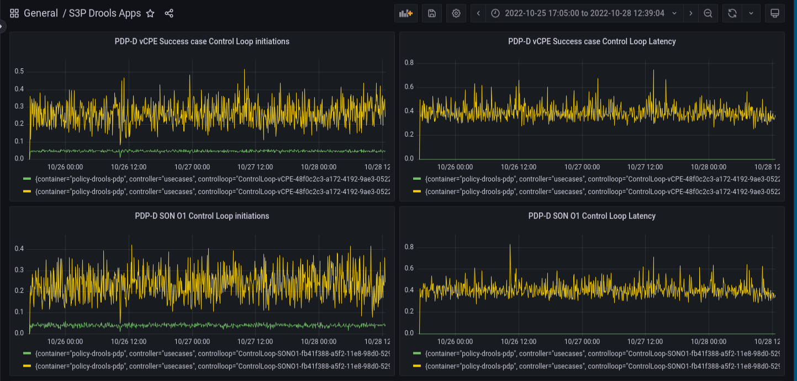
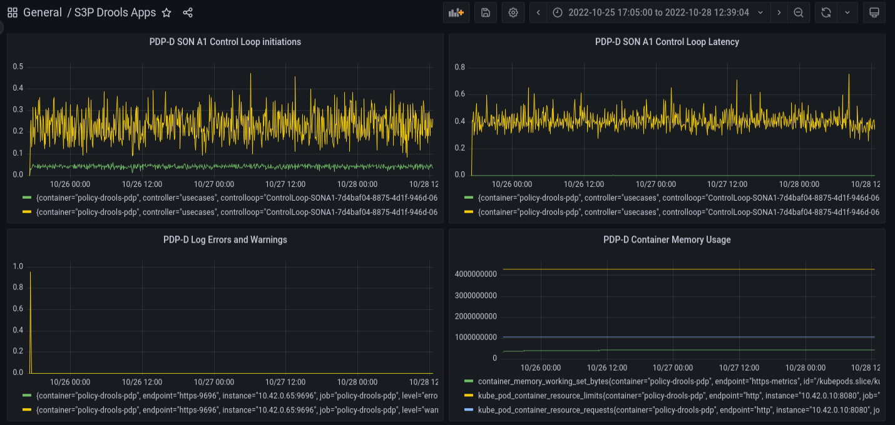
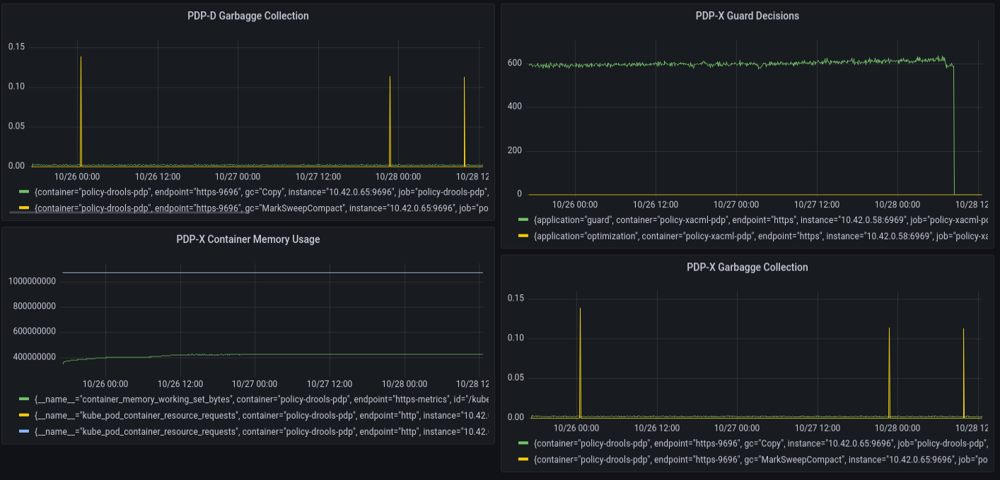

.. This work is licensed under a
.. Creative Commons Attribution 4.0 International License.
.. http://creativecommons.org/licenses/by/4.0

.. _drools-s3p-label:

.. toctree::
   :maxdepth: 2

Policy Drools PDP component
~~~~~~~~~~~~~~~~~~~~~~~~~~~

Both the Performance and the Stability tests were executed against an ONAP installation in the Policy tenant
in the UNH lab, from the admin VM running the jmeter tool to inject the load.

General Setup
*************

Agent VMs in this lab have the following configuration:

- 16GB RAM
- 8 VCPU

Jmeter is run from the admin VM.

The drools-pdp container uses the JVM memory and CPU settings from the default OOM installation.

Other ONAP components exercised during the stability tests were:

- Policy XACML PDP to process guard queries for each transaction.
- DMaaP to carry PDP-D and jmeter initiated traffic to complete transactions.
- Policy API to create (and delete at the end of the tests) policies for each
  scenario under test.
- Policy PAP to deploy (and undeploy at the end of the tests) policies for each scenario under test.
- XACML PDP Stability test was running at the same time.

The following components are simulated during the tests.

- SDNR.

Stability Test of Policy PDP-D
******************************

PDP-D performance
=================

The tests focused on the following use cases running in parallel:

- vCPE
- SON O1
- SON A1

Three threads ran in parallel, one for each scenario.  The transactions were initiated
by each jmeter thread group.  Each thread initiated a transaction, monitored the transaction, and
started the next one 250 ms. later.

The results are illustrated on the following graphs:

Commentary
==========

There is around 1% unexpected failures during the 72-hour run.   This can also be seen in the
final output of jmeter:

.. code-block:: bash

    summary = 4751546 in 72:00:37 =   18.3/s Avg:   150 Min:     0 Max: 15087 Err: 47891 (1.01%)

Sporadic database errors have been observed and seem related to the 1% failure percentage rate.
