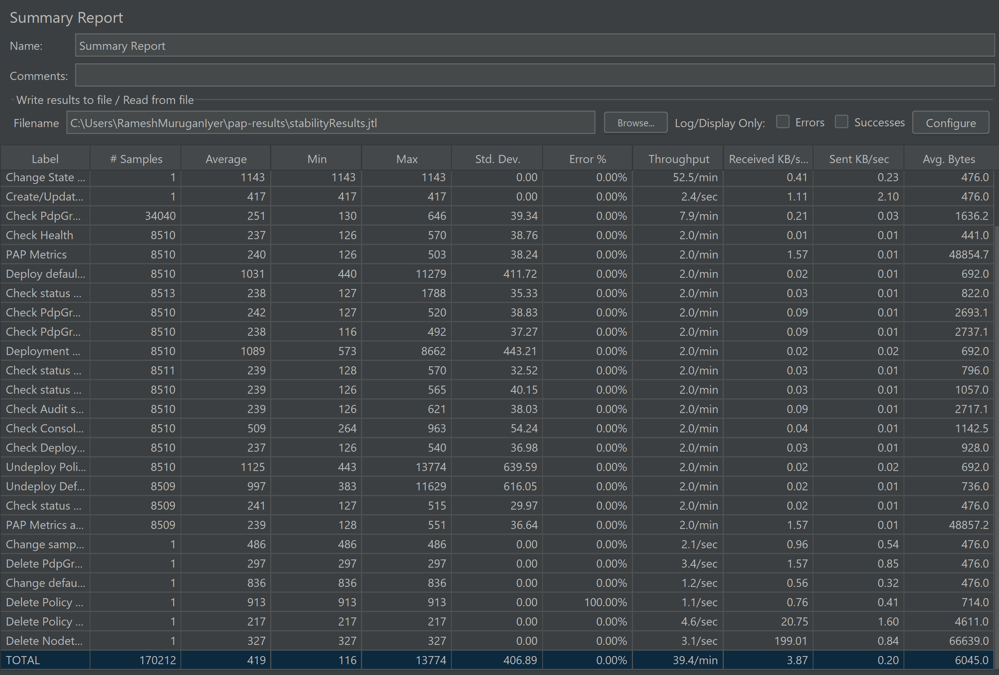
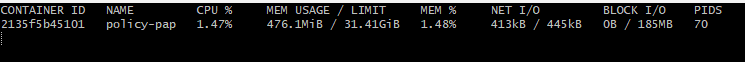
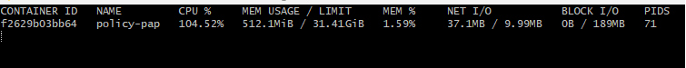
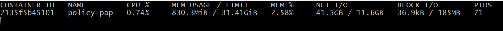
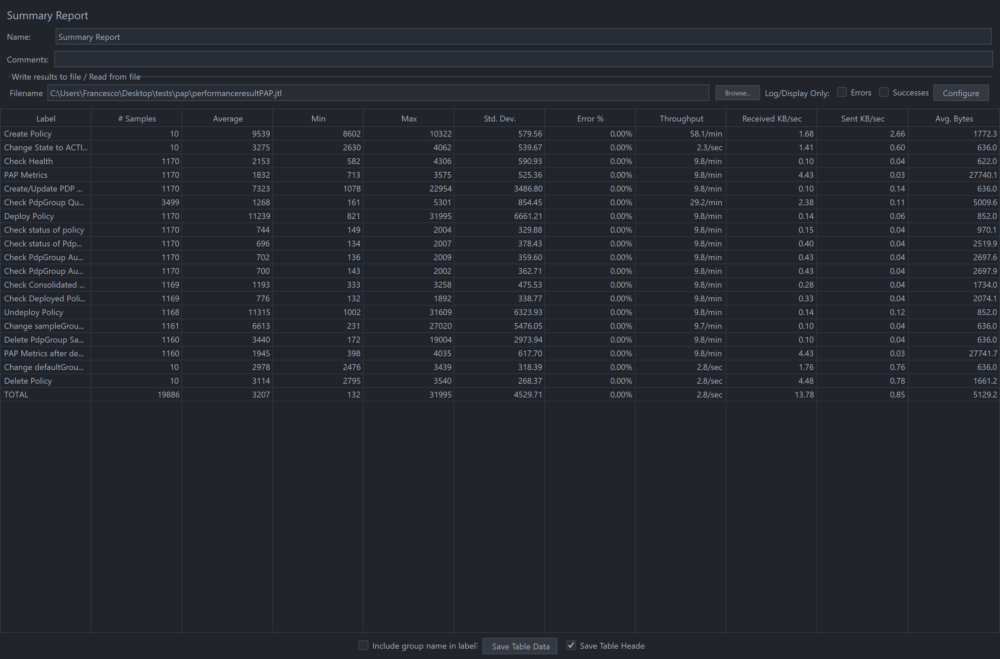

.. This work is licensed under a
.. Creative Commons Attribution 4.0 International License.
.. http://creativecommons.org/licenses/by/4.0

.. _pap-s3p-label:

.. toctree::
   :maxdepth: 2

Policy PAP component
~~~~~~~~~~~~~~~~~~~~

Both the Performance and the Stability tests were executed by performing requests
against Policy components installed as part of a full ONAP OOM deployment or a docker deployment in Nordix lab.

Setup Details
+++++++++++++

- Policy-PAP along with all policy components deployed as part of a Policy docker deployment.
- A second instance of APEX-PDP is spun up in the setup. Update the configuration file (OnapPfConfig.json) such that the PDP can register to the new group created by PAP in the tests.
- Both tests were run via jMeter.

Stability Test of PAP
+++++++++++++++++++++

Test Plan
---------
The 72 hours stability test ran the following steps sequentially in a single threaded loop.

Setup Phase (steps running only once)
"""""""""""""""""""""""""""""""""""""

- **Create Policy for defaultGroup** - creates an operational policy using policy/api component
- **Create NodeTemplate metadata for sampleGroup policy** - creates a node template containing metadata using policy/api component
- **Create Policy for sampleGroup** - creates an operational policy that refers to the metadata created above using policy/api component
- **Change defaultGroup state to ACTIVE** - changes the state of defaultGroup PdpGroup to ACTIVE
- **Create/Update PDP Group** - creates a new PDPGroup named sampleGroup.
      A second instance of the PDP that is already spun up gets registered to this new group
- **Check PdpGroup Query** - makes a PdpGroup query request and verifies that both PdpGroups are in ACTIVE state.

PAP Test Flow (steps running in a loop for 72 hours)
""""""""""""""""""""""""""""""""""""""""""""""""""""

- **Check Health** - checks the health status of pap
- **PAP Metrics** - Fetch prometheus metrics before the deployment/undeployment cycle
      Save different counters such as deploy/undeploy-success/failure counters at API and engine level.
- **Check PdpGroup Query** - makes a PdpGroup query request and verifies that both PdpGroups are in the ACTIVE state.
- **Deploy Policy for defaultGroup** - deploys the policy defaultDomain to defaultGroup
- **Check status of defaultGroup policy** - checks the status of defaultGroup PdpGroup with the defaultDomain policy 1.0.0.
- **Check PdpGroup Audit defaultGroup** - checks the audit information for the defaultGroup PdpGroup.
- **Check PdpGroup Audit Policy (defaultGroup)** - checks the audit information for the defaultGroup PdpGroup with the defaultDomain policy 1.0.0.
- **Check PdpGroup Query** - makes a PdpGroup query request and verifies that 2 PdpGroups are in the ACTIVE state and defaultGroup has a policy deployed on it.
- **Deployment Update for sampleGroup policy** - deploys the policy sampleDomain in sampleGroup PdpGroup using pap api
- **Check status of sampleGroup** - checks the status of the sampleGroup PdpGroup.
- **Check status of PdpGroups** - checks the status of both PdpGroups.
- **Check PdpGroup Query** - makes a PdpGroup query request and verifies that the defaultGroup has a policy defaultDomain deployed on it and sampleGroup has policy sampleDomain deployed on it.
- **Check Audit** - checks the audit information for all PdpGroups.
- **Check Consolidated Health** - checks the consolidated health status of all policy components.
- **Check Deployed Policies** - checks for all the deployed policies using pap api.
- **Undeploy policy in sampleGroup** - undeploys the policy sampleDomain from sampleGroup PdpGroup using pap api
- **Undeploy policy in defaultGroup** - undeploys the policy defaultDomain from PdpGroup
- **Check status of policies** - checks the status of all policies and make sure both the policies are undeployed
- **Check PdpGroup Query** - makes a PdpGroup query request and verifies that PdpGroup is in the PASSIVE state.
- **PAP Metrics after deployments** - Fetch prometheus metrics after the deployment/undeployment cycle
      Save the new counter values such as deploy/undeploy-success/failure counters at API and engine level, and check that the deploySuccess and undeploySuccess counters are increased by 2.

.. Note::
   To avoid putting a large Constant Timer value after every deployment/undeployment, the status API is polled until the deployment/undeployment
   is successfully completed, or until a timeout. This is to make sure that the operation is completed successfully and the PDPs gets enough time to respond back.
   Otherwise, before the deployment is marked successful by PAP, an undeployment could be triggered as part of other tests,
   and the operation's corresponding prometheus counter at engine level will not get updated.

Teardown Phase (steps running only once after PAP Test Flow is completed)
"""""""""""""""""""""""""""""""""""""""""""""""""""""""""""""""""""""""""

- **Change state to PASSIVE(sampleGroup)** - changes the state of sampleGroup PdpGroup to PASSIVE
- **Delete PdpGroup sampleGroup** - delete the sampleGroup PdpGroup using pap api
- **Change State to PASSIVE(defaultGroup)** - changes the state of defaultGroup PdpGroup to PASSIVE
- **Delete policy created for defaultGroup** - deletes the operational policy defaultDomain using policy/api component
- **Delete Policy created for sampleGroup** - deletes the operational policy sampleDomain using policy/api component
- **Delete Nodetemplate metadata for sampleGroup policy** - deleted the nodetemplate containing metadata for sampleGroup policy

The following steps can be used to configure the parameters of test plan.

- **HTTP Authorization Manager** - used to store user/password authentication details.
- **HTTP Header Manager** - used to store headers which will be used for making HTTP requests.
- **User Defined Variables** -  used to store following user defined parameters.

===========   ===================================================================
 **Name**      **Description**
===========   ===================================================================
 PAP_HOST      IP Address or host name of PAP component
 PAP_PORT      Port number of PAP for making REST API calls
 API_HOST      IP Address or host name of API component
 API_PORT      Port number of API for making REST API calls
===========   ===================================================================

The test was run in the background via "nohup", to prevent it from being interrupted:

.. code-block:: bash

    nohup apache-jmeter-5.6.2/bin/jmeter -n -t stability.jmx -l stabilityTestResults.jtl &

Test Results
------------

**Summary**

Stability test plan was triggered for 72 hours. There were no failures during the 72 hours test.

**Test Statistics**

=======================  =================  ==================  ==================================
**Total # of requests**  **Success %**      **Error %**         **Average time taken per request**
=======================  =================  ==================  ==================================
    168997                    100 %             0.00 %              425 ms
=======================  =================  ==================  ==================================

**JMeter Screenshot**

**Memory and CPU usage**

The memory and CPU usage can be monitored by running "docker stats" command in the PAP container.
A snapshot is taken before, during and after test execution to monitor the changes in resource utilization.
Prometheus metrics is also collected before and after the test execution.

Memory and CPU usage before test execution:

:download:`Prometheus metrics before 72h test  <pap-s3p-results/pap_metrics_before_72h.txt>`

Memory and CPU usage during test execution:

Memory and CPU usage after test execution:

:download:`Prometheus metrics after 72h test  <pap-s3p-results/pap_metrics_after_72h.txt>`

Performance Test of PAP
++++++++++++++++++++++++

Introduction
------------

Performance test of PAP has the goal of testing the min/avg/max processing time and rest call throughput for all the requests with multiple requests at the same time.

Setup Details
-------------

The performance test is performed on a similar setup as Stability test. The JMeter VM will be sending a large number of REST requests to the PAP component and collecting the statistics.

Test Plan
---------

Performance test plan is the same as the stability test plan above except for the few differences listed below.

- Increase the number of threads up to 10 (simulating 10 users' behaviours at the same time).
- Reduce the test time to 2 hours.
- Usage of counters (simulating each user) to create different pdpGroups, update their state and later delete them.
- Removed the tests to deploy policies to newly created groups as this will need a larger setup with multiple pdps registered to each group, which will also slow down the performance test with the time needed for registration process etc.
- Usage of counters (simulating each user) to create different drools policies and deploy them to defaultGroup.
      In the test, a thread count of 10 is used resulting in 10 different drools policies getting deployed and undeployed continuously for 2 hours.
      Other standard operations like checking the deployment status of policies, checking the metrics, health etc remains.

Run Test
--------

Running/Triggering the performance test will be the same as the stability test. That is, launch JMeter pointing to corresponding *.jmx* test plan. The *API_HOST* , *API_PORT* , *PAP_HOST* , *PAP_PORT* are already set up in *.jmx*.

.. code-block:: bash

    nohup apache-jmeter-5.6.2/bin/jmeter -n -t performance.jmx -l performanceTestResults.jtl &

Test Results
------------

Test results are shown as below.

**Test Statistics**

=======================  =================  ==================  ==================================
**Total # of requests**  **Success %**      **Error %**         **Average time taken per request**
=======================  =================  ==================  ==================================
199400                    100 %              0.00 %              397 ms
=======================  =================  ==================  ==================================

**JMeter Screenshot**

