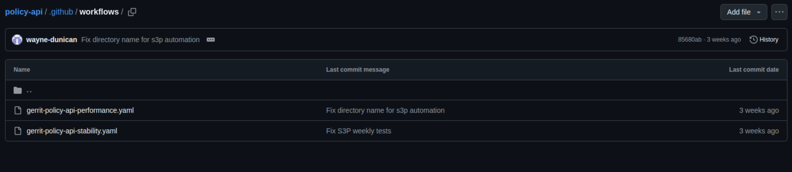
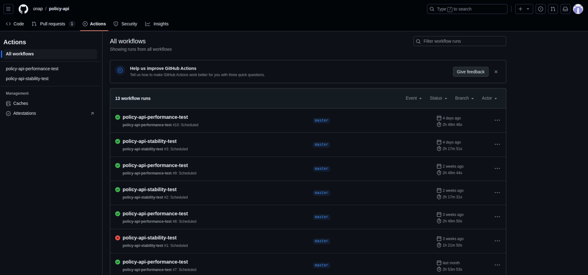
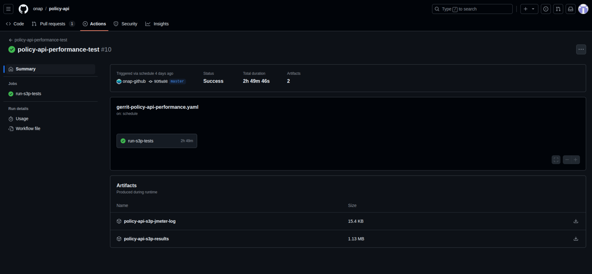

.. This work is licensed under a
.. Creative Commons Attribution 4.0 International License.
.. http://creativecommons.org/licenses/by/4.0

Policy Framework S3P Tests Overview
~~~~~~~~~~~~~~~~~~~~~~~~~~~~~~~~~~~

.. contents::
   :depth: 2

Starting with the Oslo release of the Policy Framework, S3P tests are now triggered differently.

Our S3P tests for each component run automatically every Monday. This includes both performance and stability tests. These tests are triggered in a GitHub Actions environment, and the results for each test can be found under the "Actions" tab in the GitHub repository for each component.

Stability and Performance Test Workflows
----------------------------------------

Each component of the Policy Framework contains two workflow files in the `.github/workflows` directory:
- `gerrit-{componentName}-performance.yaml`
- `gerrit-{componentName}-stability.yaml`

An example of the configuration for one of these files is shown below:

.. code-block:: yaml

    name: policy-api-stability-test

    on:
      workflow_dispatch:
      inputs:
        GERRIT_BRANCH:
          description: 'Branch that the change is against'
          required: true
          type: string
        GERRIT_CHANGE_ID:
          description: 'The ID for the change'
          required: true
          type: string
        GERRIT_CHANGE_NUMBER:
          description: 'The Gerrit change number'
          required: true
          type: string
        GERRIT_CHANGE_URL:
          description: 'URL of the change'
          required: true
          type: string
        GERRIT_EVENT_TYPE:
          description: 'The type of Gerrit event'
          required: true
          type: string
        GERRIT_PATCHSET_NUMBER:
          description: 'The patch number for the change'
          required: true
          type: string
        GERRIT_PATCHSET_REVISION:
          description: 'The SHA of the revision'
          required: true
          type: string
        GERRIT_PROJECT:
          description: 'The project in Gerrit'
          required: true
          type: string
        GERRIT_REFSPEC:
          description: 'The Gerrit refspec for the change'
          required: true
          type: string
      branch_protection_rule:
      # Ensures that the "Maintained" check is occasionally updated.
      # See https://github.com/ossf/scorecard/blob/main/docs/checks.md#maintained

      # Runs every Monday at 16:30 UTC
      schedule:
        - cron: '30 16 * * 1'

    jobs:
      run-s3p-tests:
        runs-on: ubuntu-22.04

        steps:
          - uses: actions/checkout@v4

          - name: Run S3P script
            working-directory: ${{ github.workspace }}/testsuites
            run: sudo bash ./run-s3p-test.sh run stability

          - name: Archive result .jtl
            uses: actions/upload-artifact@v4
            with:
              name: policy-api-s3p-results
              path: ${{ github.workspace }}/testsuites/automate-performance/s3pTestResults.jtl

          - name: Archive JMeter logs
            uses: actions/upload-artifact@v4
            with:
              name: policy-api-s3p-jmeter-log
              path: ${{ github.workspace }}/testsuites/automate-performance/jmeter.log

Analyzing the Results
#####################

The results of each workflow run can be found under the "Actions" tab.

To investigate the results further, click on a completed test run. You will see details about:
- The test that was executed
- The test's status (indicated by a green checkmark or a red "X")
- The artifacts produced during the test

The artifacts include:
- A test result file in `.jtl` format
- JMeter logs, which can assist in debugging test failures

Both the stability and performance tests run for two hours each in the GitHub Actions environment. Since these tests are conducted weekly and closely monitored by the Policy Framework team, the previous practice of running stability tests for 72 hours has been deemed unnecessary.
