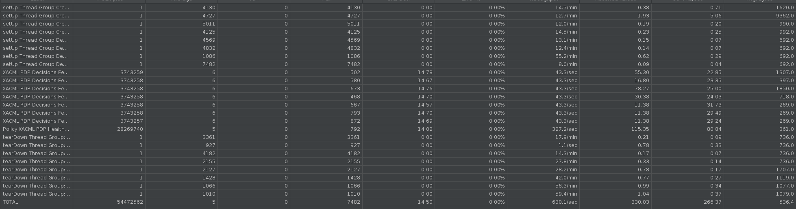

.. This work is licensed under a
.. Creative Commons Attribution 4.0 International License.
.. http://creativecommons.org/licenses/by/4.0

.. _xacml-s3p-label:

.. toctree::
   :maxdepth: 2

##########################

Policy XACML PDP S3P Tests
~~~~~~~~~~~~~~~~~~~~~~~~~~

Both the Performance and the Stability tests were executed by performing requests
against Policy components installed in Kubernetes environment. These tests were all
performed on a Ubuntu VM with 32GB of memory, 16 CPU and 100GB of disk space.

Policy XACML PDP Deployment
+++++++++++++++++++++++++++

In an effort to allow the execution of the s3p tests to be as close to automatic as possible,
a script will be executed that will perform the following:

- Install of a microk8s kubernetes environment
- Bring up the policy components
- Checks that the components are successfully up and running before proceeding
- Install Java 17
- Install Jmeter locally and configure it
- Specify whether you want to run stability or performance tests

The remainder of this document outlines how to run the tests and the test results

Common Setup
++++++++++++
The common setup for performance and stability tests is now automated - being carried out by a script in- **testsuites/run-s3p-test.sh**.

Clone the policy-xacml-pdp repo to access the test scripts

.. code-block:: bash

    git clone https://gerrit.onap.org/r/policy/xacml-pdp xacml-pdp

Stability Test of Policy XACML PDP
++++++++++++++++++++++++++++++++++

Test Plan
---------
The 24 hours stability test ran the following steps.

- Healthcheck, 2 simultaneous threads
- Decisions, 2 simultaneous threads, each running the following tasks in sequence:
   - Monitoring Decision
   - Monitoring Decision, abbreviated
   - Naming Decision
   - Optimization Decision
   - Default Guard Decision (always "Permit")
   - Frequency Limiter Guard Decision
   - Min/Max Guard Decision

This runs for 24 hours. Test results are present in the **testsuites/automated-performance/s3pTestResults.jtl**
file and in **/tmp/** directory. Logs are present for jmeter in **testsuites/automated-performance/jmeter.log** and
**testsuites/automated-performance/nohup.out**

Run Test
--------

The code in the setup section also serves to run the tests. Just one execution needed to do it all.

.. code-block:: bash

    bash run-s3p-test.sh run stability

Once the test execution is completed, the results are present in the **automate-performance/s3pTestResults.jtl** file.

This file can be imported into the Jmeter GUI for visualization. The below results are tabulated from the GUI.

Test Results
------------

**Summary**

Stability test plan was triggered for 24 hours.

**Test Statistics**

=======================  =================  ========================  =========================
**Total # of requests**  **Error %**        **Average Latency (ms)**  **Measured requests/sec**
=======================  =================  ========================  =========================
  63618103                 0.00 %             5 ms                      736.064 ms
=======================  =================  ========================  =========================

**JMeter Results**

**Policy component Setup**

==============================================  ====================================================================  ===========================================
**NAME**                                        **IMAGE**                                                             **PORT**
==============================================  ====================================================================  ===========================================
mariadb-galera-0                                docker.io/bitnami/mariadb-galera:10.5.8                               3306/TCP
policy-models-simulator-bcd494d87-cldfr         nexus3.onap.org:10001/onap/policy-models-simulator:3.0.2-SNAPSHOT     30904/TCP
policy-apex-pdp-0                               nexus3.onap.org:10001/onap/policy-apex-pdp:3.0.2-SNAPSHOT             30001/TCP
prometheus-f66f97b6-kpg5c                       nexus3.onap.org:10001/prom/prometheus:latest                          30909/TCP
policy-distribution-86777bdd78-95zjx            nexus3.onap.org:10001/onap/policy-distribution:3.0.2-SNAPSHOT         30006/TCP
policy-clamp-ac-http-ppnt-7b99cbfbf8-d5zjk      nexus3.onap.org:10001/onap/policy-clamp-ac-http-ppnt:7.0.3-SNAPSHOT
policy-clamp-ac-pf-ppnt-55c4cb99f4-pp699        nexus3.onap.org:10001/onap/policy-clamp-ac-pf-ppnt:7.0.3-SNAPSHOT     30008/TCP
policy-clamp-ac-k8s-ppnt-6d854cc8b6-nzlgh       nexus3.onap.org:10001/onap/policy-clamp-ac-k8s-ppnt:7.0.3-SNAPSHOT
policy-clamp-runtime-acm-5c6d8fbfb-zww5j        nexus3.onap.org:10001/onap/policy-clamp-runtime-acm:7.0.3-SNAPSHOT    30007/TCP
policy-pap-847d89997d-gljzh                     nexus3.onap.org:10001/onap/policy-pap:3.0.2-SNAPSHOT                  30003/TCP
policy-xacml-pdp-656d57d578-9h6fx               nexus3.onap.org:10001/onap/policy-xacml-pdp:3.0.2-SNAPSHOT            30004/TCP
policy-api-58cb45fc9b-9qcx6                     nexus3.onap.org:10001/onap/policy-api:3.0.2-SNAPSHOT                  30002/tcp
==============================================  ====================================================================  ===========================================

.. Note::

              .. container:: paragraph

                  There were no failures during the 24 hours test.

The XACML PDP offered very good performance with JMeter for the traffic mix described above.
The average transaction time is insignificant.

Performance Test of Policy XACML PDP
++++++++++++++++++++++++++++++++++++

Introduction
------------

Performance test of acm components has the goal of testing the min/avg/max processing time and rest call throughput for all the requests with multiple requests at the same time.

Setup Details
-------------

We can setup the environment and execute the tests like this from the **xacml-pdp/testsuites** directory

Test Plan
---------

Performance test plan is the same as the stability test plan above except for the few differences listed below.

- Increase the number of threads up to 10 (simulating 10 users' behaviours at the same time).
- Reduce the test time to 20 minutes.

The performance tests runs the following, all in parallel:

- Healthcheck, 10 simultaneous threads
- Decisions, 10 simultaneous threads, each running the following in sequence:

   - Monitoring Decision
   - Monitoring Decision, abbreviated
   - Naming Decision
   - Optimization Decision
   - Default Guard Decision (always "Permit")
   - Frequency Limiter Guard Decision
   - Min/Max Guard Decision

When the script starts up, it uses policy-api to create, and policy-pap to deploy
the policies that are needed by the test.  It assumes that the "naming" policy has
already been created and deployed.  Once the test completes, it undeploys and deletes
the policies that it previously created.

Run Test
--------

The code in the setup section also serves to run the tests. Just one execution needed to do it all.

.. code-block:: bash

    bash run-s3p-test.sh run performance

Once the test execution is completed, the results are present in the **automate-performance/s3pTestResults.jtl** file and in **/tmp/** directory.

This file can be imported into the Jmeter GUI for visualization. The below results are tabulated from the GUI.

Test Results
------------

**Summary**

The test was run for 20 minutes with 10 users (i.e., threads), with the following results:

**Test Statistics**

=======================  =================  ========================  =========================
**Total # of requests**  **Error %**        **Average Latency (ms)**  **Measured requests/sec**
=======================  =================  ========================  =========================
  912141                   0.00 %             25.5666 ms                741.917 ms
=======================  =================  ========================  =========================

.. image:: xacml-s3p-results/s3p-perf-xacml.png
