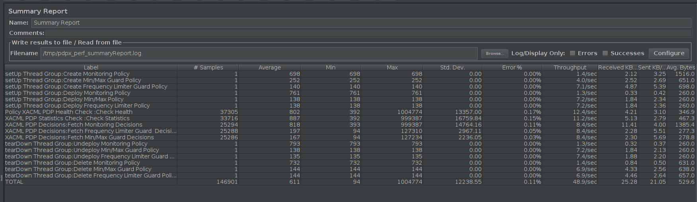

.. This work is licensed under a
.. Creative Commons Attribution 4.0 International License.
.. http://creativecommons.org/licenses/by/4.0

.. _xacml-s3p-label:

.. toctree::
   :maxdepth: 2

Policy XACML PDP component
~~~~~~~~~~~~~~~~~~~~~~~~~~

Performance Test of Policy XACML PDP
++++++++++++++++++++++++++++++++++++

Summary
-------

The Performance test was executed by performing requests against the Policy RESTful APIs residing on the XACML PDP installed in the windriver lab to get policy decisions for monitoring and guard policy types.  This was running on a kubernetes host having the following configuration:

- 16GB RAM
- 8 VCPU
- 160GB Disk

The performance test runs 10 simultaneous threads calling XACML PDP RESTful APIs to get decisions for Monitoring, Guard Min Max, and Guard Frequency Limiter policy types, with at duration of 6000 seconds.  The test execution lasted approximately 50 minutes resulting in the following summary:

- 37,305 Healthcheck requests
- 33,716 Statistics requests
- 25,294 Monitoring decision requests
- 25,288 Guard Min Max decisions
- 25,286 Guard Frequency Limiter requests

The average throughput was about 9.8 transactions per second. CPU and memory usage along with a screenshot of the JMeter Summary Report are provided in this document.

Results
-------

**CPU Utilization**

Total CPU used by the PDP was measured before and after the test, using "ps -l".

===================  ==================  ================  ===================  ===============  ==================
**Intial CPU time**  **Final CPU time**  **Intial CPU %**  **Intial Memory %**  **Final CPU %**  **Final Memory %**   
===================  ==================  ================  ===================  ===============  ==================
00:60:27             00:73:45            3.5%              4.0%                 94.12.3%         4.0%
===================  ==================  ================  ===================  ===============  ==================

**Memory Utilization**

.. code-block:: bash

    Number of young garbage collections used during the test: 518
    Avg. Young garbage collection time: ~11.56ms per collection
    Total number of Full garbage collection: 32
    Avg. Full garbage collection time: ~315.06ms per collection
     
    
     S0C         S1C        S0U    S1U      EC              EU             OC              OU            MC          MU         CCSC      CCSU     YGC     YGCT    FGC     FGCT     GCT  
    
    16768.0   16768.0  0.0   5461.0    134144.0    71223.6   334692.0     138734.5    50008.0   48955.8  5760.0    5434.3   4043    45.793  32        10.082   55.875
    
    16768.0   16768.0  0.0   4993.4    134144.0    66115.7   334692.0     252887.4    50264.0   49036.5  5760.0    5439.7   4561    53.686  32        10.082   63.768

**Jmeter Results Summary**

