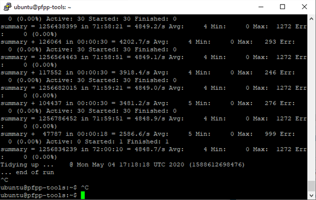
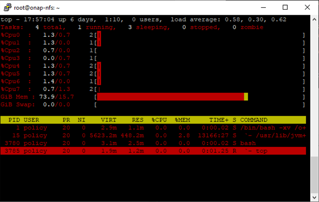

.. This work is licensed under a
.. Creative Commons Attribution 4.0 International License.
.. http://creativecommons.org/licenses/by/4.0

.. _xacml-s3p-label:

.. toctree::
   :maxdepth: 2

Policy XACML PDP component
##########################

Both the Performance and the Stability tests were executed by performing requests
against the Policy RESTful APIs residing on the XACML PDP installed in the windriver
lab.  This was running on a kubernetes pod having the following configuration:

- 16GB RAM
- 8 VCPU
- 160GB Disk

Both tests were run via jmeter, which was installed on a separate VM so-as not
to impact the performance of the XACML-PDP being tested.

Performance Test of Policy XACML PDP
************************************

Summary
=======

The Performance test was executed, and the result analyzed, via:

.. code-block:: bash

    jmeter -Jduration=1200 -Jusers=10 \
        -Jxacml_ip=$ip -Jpap_ip=$ip -Japi_ip=$ip \
        -Jxacml_port=31104 -Jpap_port=32425 -Japi_port=30709 \
        -n -t perf.jmx

    ./result.sh

Note: the ports listed above correspond to port 6969 of the respective components.

The performance test, perf.jmx, runs the following, all in parallel:

- Healthcheck, 10 simultaneous threads
- Statistics, 10 simultaneous threads
- Decisions, 10 simultaneous threads, each running the following in sequence:
  - Monitoring Decision
  - Monitoring Decision, abbreviated
  - Naming Decision
  - Optimization Decision
  - Default Guard Decision (always "Permit")
  - Frequency Limiter Guard Decision
  - Min/Max Guard Decision

When the script starts up, it uses policy-api to create, and policy-pap to deploy,
the policies that are needed by the test.  It assumes that the "naming" policy has
already been created and deployed.  Once the test completes, it undeploys and deletes
the policies that it previously created.

Results
=======

The test was run for 20 minutes at a time, for different numbers of users (i.e.,
threads), with the following results:

.. csv-table::
   :header: "Number of Users", "Throughput (requests/second)", "Average Latency (ms)"

   "10", "6064", "4.1"
   "20", "6495", "7.2"
   "40", "6457", "12.2"
   "80", "5803", "21.3"

Stability Test of Policy XACML PDP
************************************

Summary
=======

The Stability test was run with the same pods/VMs and uses the same jmeter script as the
performance test, except that it was run for 72 hours instead of 20 minutes.  In
addition, it was run in the background via "nohup", to prevent it from being interrupted:

.. code-block:: bash

    nohup jmeter -Jduration=259200 \
        -Jxacml_ip=$ip -Jpap_ip=$ip -Japi_ip=$ip \
        -Jxacml_port=31104 -Jpap_port=32425 -Japi_port=30709 \
        -n -t perf.jmx &

The memory and CPU usage can be monitored by running "top" on the xacml pod.  By taking
a snapshot before the test is started, and again when it completes, the total CPU used
by all of the requests can be computed.

Results
=======

The final output of the jmeter script is found in the nohup.out file:

The final memory and CPU from "top":

The through-put reported by jmeter was 4849 requests/second, with 0 errors.  In addition,
the memory usage observed via "top" indicated that the virtual memory and resident set
sizes remained virtually unchanged through-out the test.

Unfortunately, the initial CPU usage was not recorded, so the CPU time reported in
the "top" screen-shot includes PAP start-up time as well as requests that were executed
before the stability test was started.  Nevertheless, even including that, we find:

.. code-block:: bash

    13,166 CPU minutes * 60sec/min * 1000ms/sec / 1,256,834,239 requests = 0.63ms/request
