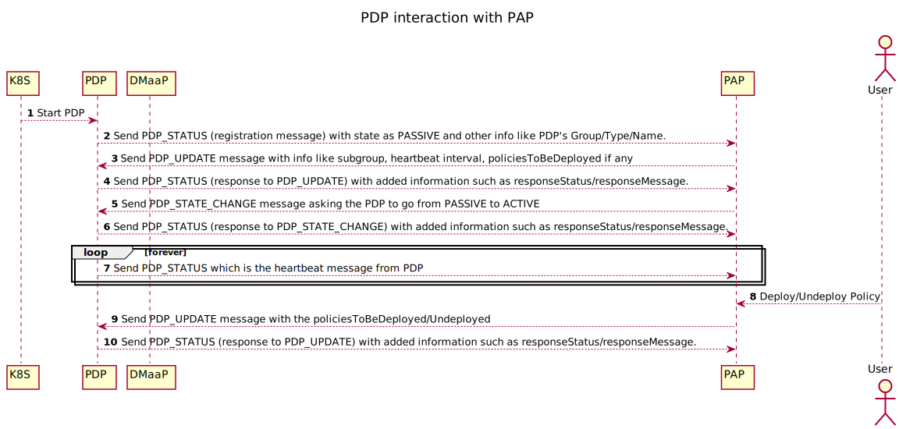

.. This work is licensed under a
.. Creative Commons Attribution 4.0 International License.
.. http://creativecommons.org/licenses/by/4.0

.. _pdp-pap-interaction-label:

Guidelines for PDP-PAP interaction
###################################

.. contents::
    :depth: 3

A PDP (Policy Decision Point) is where the policy execution happens. The administrative actions such as
managing the PDPs, deploying or undeploying policies to these PDPs etc. are handled by PAP
(Policy Administration Point). Any PDP should follow certain behavior to be registered and functional in
the Policy Framework. All the communications between PAP and PDP happen over Kafka on topic *POLICY-PDP-PAP*.
The below diagram shows how a PDP interacts with PAP.

**1. Start PDP**

A PDP should be configured to start with the below information in its startup configuration file.

- *pdpGroup* to which the PDP should belong to.
- *Kafka topic* 'POLICY-PDP-PAP' which should be the source and sink for communicating with PAP.

**2. PDP sends PDP_STATUS (registration message)**

As soon as a PDP is up, it sends a registration message to POLICY-PDP-PAP topic.
Some of the information included in the message are:

- *pdpType* the type of the PDP (apex/drools/xacml etc.).
- *pdpGroup* to which the PDP should belong to.
- *state* the initial state of the PDP which is PASSIVE.
- *healthy* whether the PDP is "HEALTHY" or not.
- *name* a name that is unique to the PDP instance.

.. code-block::
  :caption: Sample PDP_STATUS Registration message (from APEX-PDP)
  :linenos:

    {
      "pdpType": "apex",
      "state": "PASSIVE",
      "healthy": "HEALTHY",
      "description": "Pdp Heartbeat",
      "statistics": {
        ..... Omitted for brevity
      },
      "messageName": "PDP_STATUS",
      "requestId": "54926ad0-440f-4b40-9237-40ca754ad00d",
      "timestampMs": 1632325024286,
      "name": "apex-45c6b266-a5fa-4534-b22c-33c2f9a45d02",
      "pdpGroup": "defaultGroup"
    }

**3. PAP sends PDP_UPDATE message**

On receiving the registration message from a PDP, PAP checks and assigns it to a subgroup under the group.
If there are policies that were already deployed (for e.g. previously deployed, and the PDP is restarted)
under the subgroup, then the *policiesToBeDeployed* are also sent along with the *subgroup* it is assigned to.
PAP also sends the *pdpHeartbeatIntervalMs* which is the time interval in which PDPs should send heartbeats to PAP.

.. code-block:: json
  :caption: Sample PDP_UPDATE message (for APEX-PDP)
  :linenos:

    {
      "source": "pap-56c8531d-5376-4e53-a820-6973c62bfb9a",
      "pdpHeartbeatIntervalMs": 120000,
      "policiesToBeDeployed": [],
      "messageName": "PDP_UPDATE",
      "requestId": "3534e54f-4432-4c68-81c8-a6af07e59fb2",
      "timestampMs": 1632325037040,
      "name": "apex-45c6b266-a5fa-4534-b22c-33c2f9a45d02",
      "pdpGroup": "defaultGroup",
      "pdpSubgroup": "apex"
    }

**4. PDP sends PDP_STATUS response to PDP_UPDATE**

PDP on receiving the PDP_UPDATE message from the Kafka topic, it first checks if the message is intended for the PDP.
If so, it updates itself with the information in PDP_UPDATE message from PAP such as *pdpSubgroup*,
*pdpHeartbeatIntervalMs* and *policiesToBeDeployed* (if any). After handling the PDP_UPDATE message, the PDP sends
a response message back to PAP with the current status of the PDP along with the result of the PDP_UPDATE operation.

.. code-block::
  :caption: Sample PDP_STATUS response message (from APEX-PDP)
  :linenos:

    {
      "pdpType": "apex",
      "state": "PASSIVE",
      "healthy": "HEALTHY",
      "description": "Pdp status response message for PdpUpdate",
      "policies": [],
      "statistics": {
        ..... Omitted for brevity
      },
      "response": {
        "responseTo": "3534e54f-4432-4c68-81c8-a6af07e59fb2",
        "responseStatus": "SUCCESS",
        "responseMessage": "Pdp update successful."
      },
      "messageName": "PDP_STATUS",
      "requestId": "e3c72783-4e91-4cb5-8140-e4ac0630706d",
      "timestampMs": 1632325038075,
      "name": "apex-45c6b266-a5fa-4534-b22c-33c2f9a45d02",
      "pdpGroup": "defaultGroup",
      "pdpSubgroup": "apex"
    }

**5. PAP sends PDP_STATE_CHANGE message**

PAP sends PDP_STATE_CHANGE message to PDPs to change the state from PASSIVE to active
or ACTIVE to PASSIVE. When a PDP is in PASSIVE state, the policy execution will not happen.
All PDPs start up in PASSIVE state, and they can be changed to ACTIVE/PASSIVE using PAP.
After registration is complete, PAP makes a PDP ACTIVE by default.

.. code-block:: json
  :caption: Sample PDP_STATE_CHANGE message
  :linenos:

    {
      "source": "pap-56c8531d-5376-4e53-a820-6973c62bfb9a",
      "state": "ACTIVE",
      "messageName": "PDP_STATE_CHANGE",
      "requestId": "90eada6d-bb98-4750-a4e1-b439cb5e041d",
      "timestampMs": 1632325037040,
      "name": "apex-45c6b266-a5fa-4534-b22c-33c2f9a45d02",
      "pdpGroup": "defaultGroup",
      "pdpSubgroup": "apex"
    }

**6. PDP sends PDP_STATUS response to PDP_STATE_CHANGE**

PDP updates its state as per the PDP_STATE_CHANGE received from PAP. When a PDP is changed
to ACTIVE, any policies that are already pushed to the PDP start execution
and start processing events as per the policies deployed. If no policies are running in a PDP,
then it waits in ACTIVE state, ready to execute any policies as and when they are pushed
to them from PAP. After handling the PDP_STATE_CHANGE message, the PDP sends a response message
back to PAP with the current status of the PDP along with the result of the PDP_STATE_CHANGE operation.

.. code-block::
  :caption: Sample PDP_STATUS response message (from APEX-PDP)
  :linenos:

    {
      "pdpType": "apex",
      "state": "ACTIVE",
      "healthy": "HEALTHY",
      "description": "Pdp status response message for PdpStateChange",
      "policies": [],
      "statistics": {
        ..... Omitted for brevity
      },
      "response": {
        "responseTo": "90eada6d-bb98-4750-a4e1-b439cb5e041d",
        "responseStatus": "SUCCESS",
        "responseMessage": "State changed to active. No policies are running."
      },
      "messageName": "PDP_STATUS",
      "requestId": "8a88806c-4d3e-4c80-8048-dc85d4bb75dd",
      "timestampMs": 1632325043068,
      "name": "apex-45c6b266-a5fa-4534-b22c-33c2f9a45d02",
      "pdpGroup": "defaultGroup",
      "pdpSubgroup": "apex"
    }

**7. PDP sends PDP_STATUS Heartbeat messages**

A PDP has to send Heartbeat messages to PAP periodically with the current status information
of the PDP. PAP receives this information and makes sure they are updated. In case of any mismatch
with the data in the database, PAP sends out a PDP_UPDATE message to update the PDP.
PAP considers a PDP as expired if three consecutive heartbeats are missing from the PDP,
and removes the PDP instance details from the database.

.. code-block::
  :caption: Sample PDP_STATUS response message (from APEX-PDP)
  :linenos:

    {
      "pdpType": "apex",
      "state": "ACTIVE",
      "healthy": "HEALTHY",
      "description": "Pdp Heartbeat",
      "policies": [],
      "statistics": {
        ..... Omitted for brevity
      },
      "messageName": "PDP_STATUS",
      "requestId": "e3c72783-4e91-4cb5-8140-e4ac0630706d",
      "timestampMs": 1632325038075,
      "name": "apex-45c6b266-a5fa-4534-b22c-33c2f9a45d02",
      "pdpGroup": "defaultGroup",
      "pdpSubgroup": "apex"
    }

**8. Deploy/Undeploy Policy using PAP**

Policies can be deployed or undeployed using PAP APIs. PAP fetches the policies to be deployed
from the database, and send the whole policies' list under *policiesToBeDeployed* field.
In case of undeployment, PAP sends the list of policies with their name and version under
*policiesToBeUndeployed* in the PDP_UPDATE message.

**9. PAP sends PDP_UPDATE message with policiesToBeDeployed/Undeployed**

PAP sends a PDP_UPDATE message with information about policies to be deployed and
undeployed. If there are some policies that are already deployed, then only the new ones
are sent under the *policiesToBeDeployed* field.

.. code-block::
  :caption: Sample PDP_STATUS response message (from APEX-PDP)
  :linenos:

    {
      "source": "pap-56c8531d-5376-4e53-a820-6973c62bfb9a",
      "pdpHeartbeatIntervalMs": 120000,
      "policiesToBeDeployed": [
        {
          "type": "onap.policies.native.Apex",
          "type_version": "1.0.0",
          "properties": {
          ..... Omitted for brevity
          },
          "name": "onap.policies.apex.Simplecontrolloop",
          "version": "1.0.0",
          "metadata": {
            "policy-id": "onap.policies.apex.Simplecontrolloop",
            "policy-version": "1.0.0"
          }
        }
      ],
      "policiesToBeUndeployed":[],
      "messageName": "PDP_UPDATE",
      "requestId": "3534e54f-4432-4c68-81c8-a6af07e59fb2",
      "timestampMs": 1632325037040,
      "name": "apex-45c6b266-a5fa-4534-b22c-33c2f9a45d02",
      "pdpGroup": "defaultGroup",
      "pdpSubgroup": "apex"
    }

**10. PDP sends PDP_STATUS response to PDP_UPDATE**

All policies to be deployed/undeployed are updated in the PDP engine.
Policies that are part of policiesToBeDeployed are updated to the engine, and
all policies under policiesToBeUndeployed are removed from the PDP engine.
Once the processing of PDP_UPDATE message is complete, PDP sends back a PDP_STATUS
message with the updated status, the current list of policies that are in the
engine, and the result of the PDP_UPDATE operation.

.. code-block:: json
  :caption: Sample PDP_STATUS response message (from APEX-PDP)
  :linenos:

    {
      "pdpType": "apex",
      "state": "ACTIVE",
      "healthy": "HEALTHY",
      "description": "Pdp status response message for PdpUpdate",
      "policies": [
        {
          "name": "onap.policies.apex.Simplecontrolloop",
          "version": "1.0.0"
        }
      ],
      "statistics": {
        "pdpInstanceId": "apex-45c6b266-a5fa-4534-b22c-33c2f9a45d02",
        "timeStamp": "2021-09-22T15:37:18.075436Z",
        "pdpGroupName": "defaultGroup",
        "pdpSubGroupName": "apex",
        "policyExecutedCount": 0,
        "policyExecutedSuccessCount": 0,
        "policyExecutedFailCount": 0,
        "policyDeployCount": 1,
        "policyDeploySuccessCount": 1,
        "policyDeployFailCount": 0,
        "policyUndeployCount": 0,
        "policyUndeploySuccessCount": 0,
        "policyUndeployFailCount": 0
      },
      "response": {
        "responseTo": "4534e54f-4432-4c68-81c8-a6af07e59fb2",
        "responseStatus": "SUCCESS",
        "responseMessage": "Apex engine started. Deployed policies are: onap.policies.apex.Simplecontrolloop:1.0.0"
      },
      "messageName": "PDP_STATUS",
      "requestId": "e3c72783-4e91-4cb5-8140-e4ac0630706d",
      "timestampMs": 1632325038075,
      "name": "apex-45c6b266-a5fa-4534-b22c-33c2f9a45d02",
      "pdpGroup": "defaultGroup",
      "pdpSubgroup": "apex"
    }

More details about the messages used for PDP-PAP internal communication and their structure can be found here
:ref:`The Internal Policy Framework PAP-PDP API <pap-pdp-label>`.
