.. This work is licensed under a  Creative Commons Attribution
.. 4.0 International License.
.. http://creativecommons.org/licenses/by/4.0

Using Monitoring Gui
--------------------

    .. container:: paragraph

        Here is an example running Monitoring Gui on a Native Windows Computer.

Environment setup
#################

    .. container:: paragraph

        create and run docker images about the following tar packages

        .. container:: listingblock

            .. container:: content

                .. code::
                    :number-lines:

                    docker load-i pdp.tar
                    docker load-i mariadb.tar
                    docker load-i api.tar
                    docker load-i apex.tar
                    docker load-i pap.tar
                    docker load-i xacml.tar

                .. container:: paragraph

                    download latest source from gerrit and create tar by command

                    .. code::
                        :number-lines:

                        tar example example.tar

        .. container:: paragraph

            download drools-pdp latest source from gerrit

        .. container:: paragraph

            prepare eclipse for starting drools-pdp

        .. container:: paragraph

            config drools-pdp dependency in eclipse

    .. container:: ulist

        - create config folder inside drools-pdp\policy-management, copy feature-lifecycle.properties into this folder

            .. container:: imageblock

                .. container:: content

                    |Create the Folder Arc|

            .. container:: content

                .. code::
                    :number-lines:

                    lifecycle.pdp.group=${envd:POLICY_PDP_PAP_GROUP:defaultGroup}

                    dmaap.source.topics=POLICY-PDP-PAP
                    dmaap.sink.topics=POLICY-PDP-PAP

                    dmaap.source.topics.POLICY-PDP-PAP.servers=localhost:3904
                    dmaap.source.topics.POLICY-PDP-PAP.managed=false

                    dmaap.sink.topics.POLICY-PDP-PAP.servers=localhost:3904
                    dmaap.sink.topics.POLICY-PDP-PAP.managed=false

        - update run property "classpath" of "drools.system.Main" in Eclipse

            .. container:: imageblock

                .. container:: content

                    |Update run Property|

            .. container:: imageblock

                .. container:: content

                    |Lifecycle classpath setting|

Prepare Postman for sending REST request to components during demo
##################################################################

    .. container:: paragraph

        import "demo.postman_collection.json" into PostMan

                .. container:: imageblock

                    .. container:: content

                        |Import JSON in PostMan|

        .. container:: content

             "demo.postman_collection.json", ":download:`link <demo.postman_collection.json>`"

    .. container:: paragraph

        clean docker environment

            .. code::
                :number-lines:

                # docker rm $(docker ps-aq)

Demo steps
##########
    .. container:: paragraph

        docker compose start mariadb and message-router. Mariadb must be started in a seperate console because it needs several seconds to finish startup, and other docker startups depends on this

    .. container::

        .. container:: content

            .. code::
                :number-lines:

                # docker-compose up -d mariadb message-router

    .. container:: paragraph

        docker compose start other components API, PAP, APEX-PDP, XACML-PDP

    .. container::

        .. container:: content

            .. code::
                :number-lines:

                # docker-compose up -d pdp xacml pap api

    .. container:: paragraph

        start "drools.system.Main" in eclipse

    .. container:: paragraph

        verify PDPs are registered into the database

        .. container:: ulist

            - get pdp lists in database

                .. container:: paragraph

                    curl --location --request GET 'http://localhost:7979/policy/pap/v1/pdps' --user 'healthcheck:zb!XztG34' | json_pp

            - get statistics

                .. container:: paragraph

                    curl --location --request GET 'http://localhost:7979/policy/pap/v1/pdps/statistics/' --user 'healthcheck:zb!XztG34' | json_pp

        .. container:: ulist

            - start PAP statistics monitoring GUI

                .. container:: paragraph

                    java -jar client/client-monitoring/target/client-monitoring-uber 2.2.0-SNAPSHOT.jar

            - open monitor in browser

                .. container:: paragraph

                    curl localhost:18999

    .. container:: paragraph

        set up pap parameter

        .. container:: imageblock

            .. container:: content

                |Pap parameter|

    .. container:: paragraph

        input parameters

        .. container:: imageblock

                .. container:: content

                    |Set up pap parameter|

    .. container:: paragraph

        Fetch PdpLists

        .. container:: imageblock

                .. container:: content

                    |Fetch Pdp Lists|

    .. container:: paragraph

        no Engine Worker started, we can only see healthcheck result when we click on the instance APEX statistics

        .. container:: imageblock

                |No engine worker started|

    .. container:: paragraph

        XACML statistics

        .. container:: imageblock

                |XACML statistics|

    .. container:: paragraph

        use PostMan to send request to API to create policy type/create policy/ deploy policy

            .. container:: content

                    .. code::
                        :number-lines:

                        API_Create Policy Type
                        API_Create Policy
                        Simple Deploy Policy

    .. container:: paragraph

        now APEX PDP statistics data includes engine worker statistics, and shows the monitoring GUI updating automatically (every 2 minutes)

        .. container:: imageblock

                |Engine worker started|

    .. container:: paragraph

        use PostMan to send a request to DMAAP, add one xacml-pdp statistics message manually, show that the monitoring GUI updates the PostMan API

    .. container::

        .. container ::content

            .. code::
                :number-lines:
                Update Xacml Stats

    .. container:: paragraph

        xacml-pdp statistics update

        .. container:: imageblock

                |Update XACML statistics|

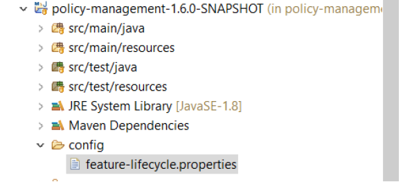
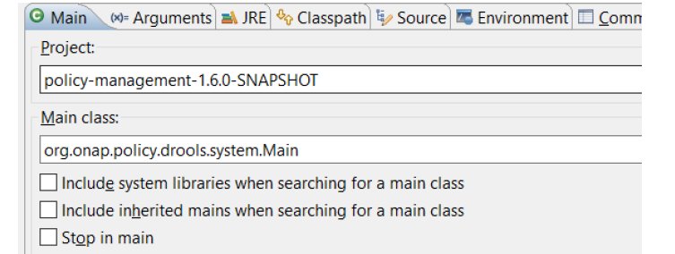
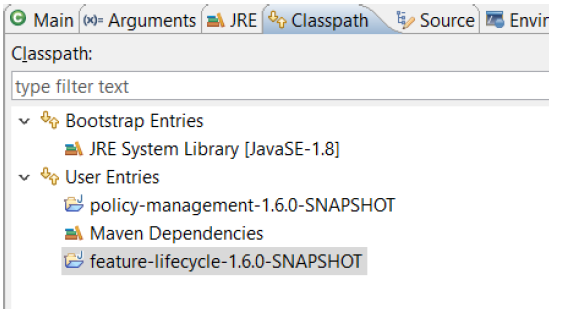
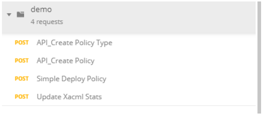
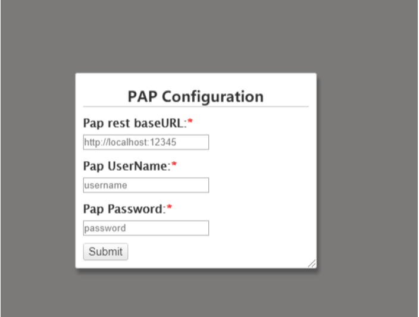
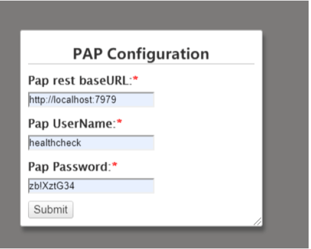
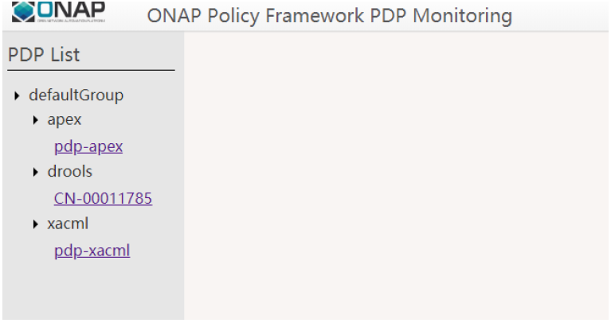
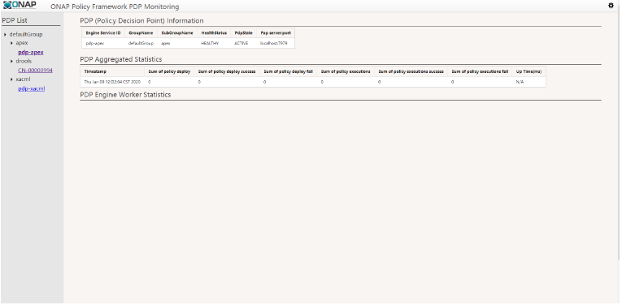
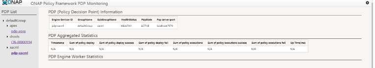
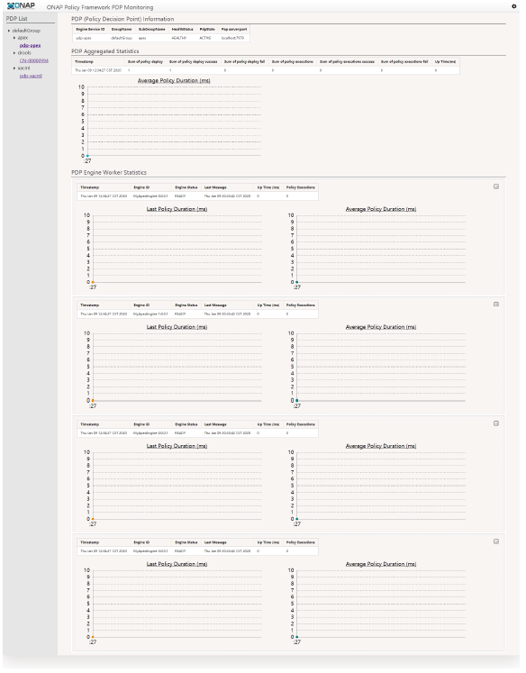
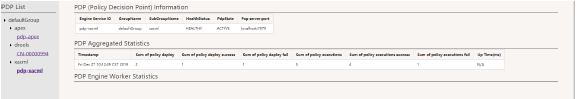