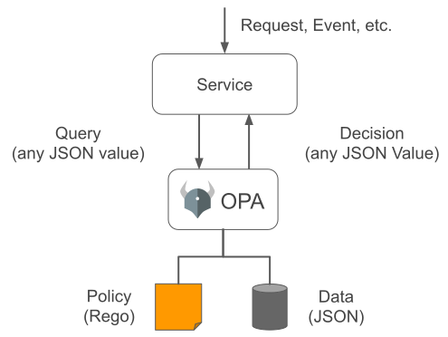

.. This work is licensed under a Creative Commons Attribution 4.0 International License.

Introduction to OPA
***************************

.. contents::
    :depth: 3

1. Introduction to OPA
^^^^^^^^^^^^^^^^^^^^^^

      .. container:: sectionbody

         .. container:: paragraph

            `Open Policy Agent (OPA) <https://www.openpolicyagent.org/docs/latest/>`__ is an open-source, general-purpose policy engine that unifies policy enforcement across the stack.
            It allows you to decouple policy decisions from your service's code, making it easier to manage and maintain policies.
            The integration of Open Policy Agent (OPA) as a Policy Decision Point (PDP) within the Open Network Automation Platform (ONAP) enhances the platform's policy management capabilities.
            OPA provides a flexible and scalable solution for enforcing policies across various components of ONAP.

         .. container:: imageblock

            .. container:: content

               |OPA Overview|

            .. container:: title

               Figure 1. OPA Overview

2. Key Benefits
^^^^^^^^^^^^^^^

      .. container:: sectionbody

         .. container:: paragraph

            - **Unified Policy Enforcement**: OPA allows for consistent policy enforcement across different ONAP modules, ensuring that policies are applied uniformly.
            - **Declarative Policy Language**: Policies are written in Rego, a high-level declarative language, making them easy to understand and maintain.
            - **Scalability**: OPA's architecture supports horizontal scaling, allowing it to handle large volumes of policy decisions efficiently.

3. Use Cases
^^^^^^^^^^^^

      .. container:: sectionbody

         .. container:: paragraph

            - **Access Control**: Enforcing fine-grained access control policies for ONAP services.
            - **Resource Management**: Applying policies to manage and allocate network resources efficiently.
            - **Compliance**: Ensuring that ONAP operations comply with regulatory and organizational policies.

4. Rego Language
^^^^^^^^^^^^^^^^

      .. container:: sectionbody

         .. container:: paragraph

            `Rego <https://www.openpolicyagent.org/docs/latest/#rego/>`__  is a declarative query language used by the Open Policy Agent (OPA) to write policy as code. It is designed to be easy to read and write, focusing on providing powerful support for referencing nested documents and ensuring that queries are correct and unambiguous.Rego is a powerful and flexible language for defining policies in a declarative manner. It is an essential tool for anyone looking to implement policy as code in their applications.

4.1 Rego Key Features
######################

      .. container:: sectionbody

         .. container:: paragraph

            - **Declarative**: Rego allows you to specify what you want to achieve rather than how to achieve it.
            - **JSON Support**: Rego works seamlessly with JSON data, making it ideal for modern applications.
            - **Policy as Code**: Rego enables you to define policies that can be version-controlled and integrated into your CI/CD pipelines.

4.2 Basic Syntax
######################

      .. container:: sectionbody

         .. container:: paragraph

            Rego rules are defined using a simple and intuitive syntax. Here is an example of a basic rule:

         .. container:: codeblock

            .. container:: content

               .. code-block:: rego

                  package example
                  import rego.v1

                  default allow = false

                  allow if {
                      input.user == "alice"
                  }

         .. container:: paragraph

            In this example, the `allow` rule is defined to be true if the `input.user` is "alice".

4.3 Advanced Features
###########################

      .. container:: sectionbody

         .. container:: paragraph

            Rego supports a variety of advanced features, including:

            - **Composite Values**: You can define rules using composite values such as objects and arrays.
            - **Built-in Functions**: Rego provides a rich set of built-in functions for manipulating data.
            - **Modules**: You can organize your policies into reusable modules.

4.4 Example
############

      .. container:: sectionbody

         .. container:: paragraph

            Here is a more complex example that demonstrates some of Rego's capabilities:

         .. container:: codeblock

            .. container:: content

               .. code-block:: rego

                  package example
                  import rego.v1

                  import data.servers

                  default allow = false

                  allow if {
                      input.user == "admin"
                      servers[input.server].owner == input.user
                  }

         .. container:: paragraph

            In this example, the `allow` rule checks if the `input.user` is "admin" and if they own the specified server.

.. container::
   :name: footer

   .. container::
      :name: footer-text

      1.0.0-SNAPSHOT
      Last updated 2025-03-27 16:04:24 IST

