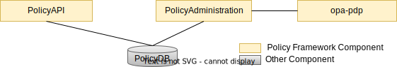

.. This work is licensed under a Creative Commons Attribution 4.0 International License.
.. http://creativecommons.org/licenses/by/4.0

Policy OPA PDP Engine
#####################

.. contents::
    :depth: 3

Policy OPA PDP Engine
^^^^^^^^^^^^^^^^^^^^^

      .. container:: sectionbody

         .. container:: paragraph

            The ONAP OPA Policy PDP Engine leverages OPA, an `open source implementation <https://github.com/open-policy-agent/opa>`__, to support fine-grained policy decisions in the ONAP. The REGO 1.0 Standard serves as the policy language for access control decisions. The ONAP OPA PDP translates TOSCA Compliant Policies into the Rego language, loads them into the OPA engine, exposes a decision api for delivering decisions.

ONAP OPA PDP Supported Policy Types
^^^^^^^^^^^^^^^^^^^^^^^^^^^^^^^^^^^

      .. container:: sectionbody

         .. container:: paragraph

            Currently, only Native Policy is supported. This policy type can be used by any client or ONAP component that requires native OPA evaluation:

         .. csv-table:: Supported Base Policy Types
            :header: "Application", "Base Policy Type", "Description"

            "Native", "onap.policies.native.opa", "OPA PDP Policies"

         .. container:: paragraph

            The TOSCA template for the OPA policy type is shown below:

         .. literalinclude:: resources/onap.policies.native.opa.yaml
            :language: YAML
            :caption: OPA Policy type
            :linenos:
How OPA PDP Works in ONAP Policy Framework
^^^^^^^^^^^^^^^^^^^^^^^^^^^^^^^^^^^^^^^^^^

      .. container:: sectionbody

         .. container:: paragraph

            opa-pdp integrates into policy framework like any other pdp engine in policy framework

            1. **Policy Definition**: Policies are defined using native opa policytype and stored in a central repository.
            2. **Policy Deployment**: The Policy Administration Point (PAP) deploys these policies to the OPA PDP instances.
            3. **Policy Evaluation**: When a policy decision is needed, ONAP components can query the OPA PDP, which evaluates the request against the deployed policies and returns a decision.
            4. **Policy Updates**: The PAP can update policies dynamically, and OPA PDP instances will automatically pick up these changes without downtime.

         .. container:: imageblock

            .. container:: content

               |ONAP POLICY FRAMEWORK|

.. container:: footer
   :name: footer

   .. container:: footer-text
      :name: footer-text

