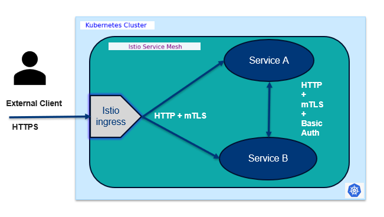

.. This work is licensed under a Creative Commons Attribution 4.0 International License.
.. http://creativecommons.org/licenses/by/4.0

ONAP Policy OPA PDP - OpenSSF Compliance and Security
*****************************************************

.. contents::
    :depth: 3

Overview
^^^^^^^^

The `policy-opa-pdp` component is part of the ONAP Policy Framework and plays a critical role in making policy decisions using the Open Policy Agent (OPA). As part of ONAP's commitment to secure and reliable open-source software, this component aligns with the OpenSSF (Open Source Security Foundation) best practices. It is designed with security and compliance in mind, aligning with ONAP's broader goals of secure, policy-driven automation. Its OpenSSF Gold alignment ensures that it meets industry standards for open-source software security and reliability.

OpenSSF Compliance
^^^^^^^^^^^^^^^^^^

The ONAP Policy Framework, including the `policy-opa-pdp`, has achieved **OpenSSF Gold Standard** compliance. This reflects adherence to secure development practices, vulnerability management, and continuous integration standards.

OPA Policy and Istio Security Integration
^^^^^^^^^^^^^^^^^^^^^^^^^^^^^^^^^^^^^^^^^

Service Mesh Security Model
###########################

Module: ``policy-opa-pdp``

External Communication
----------------------

   - All external requests entering the mesh are secured using **HTTPS**.
   - These requests are typically routed through an **Istio Ingress Gateway**, which handles TLS termination and enforces external security policies.

Internal Service-to-Service Communication
-----------------------------------------

   - Within the mesh, services communicate over **HTTP**.
   - **Mutual TLS (mTLS)** is enforced by Istio for all internal traffic, ensuring encryption in transit and service identity verification.

Authentication && Authorization
-------------------------------

   - Currently, there is **no Role-Based Authorization** implemented within the mesh.
   - Access control is limited to basic authentication and mTLS-based identity verification.

         .. container:: imageblock

            .. container:: content

               |OOM SERVICE MESH|
         
Security Documentation
^^^^^^^^^^^^^^^^^^^^^^

As part of the ONAP **Paris release (May 2025)**, the following security improvements have been implemented:
    - All internal communication is secured using **Istio Service Mesh**.
    - **Hard-coded credentials** have been removed.
    - Kubernetes pods now run with **non-root privileges**.
    - Authentication is handled locally using secure secrets.
    - Secrets are stored and accessed in a secure manner, avoiding hard-coded values.
    - These credentials are strictly local to the pod and have **no external reachability**.
    - The entire component is encapsulated within a **secure Istio mesh architecture**, ensuring that all inter-service communication is encrypted and authenticated between microservices.

.. container::
   :name: footer

   .. container::
      :name: footer-text

      1.0.0-SNAPSHOT
      Last updated 2025-03-27 16:04:24 IST

