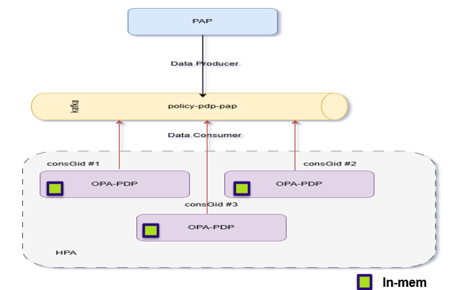
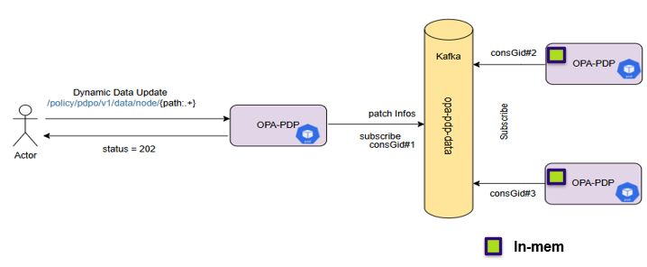

.. This work is licensed under a Creative Commons Attribution 4.0 International License.
.. http://creativecommons.org/licenses/by/4.0

OPA-PDP Scalability Overview
############################

This document outlines the scalability mechanisms used by OPA-PDP for both policy and dynamic data synchronization across multiple pods in a distributed environment.

.. contents::
    :depth: 3

OPA-PDP Policy Scalability
^^^^^^^^^^^^^^^^^^^^^^^^^^

      .. container:: sectionbody

         .. container:: paragraph
 
            OPA-PDP achieves policy scalability and consistency using Kafka-based synchronization:
            - Each OPA-PDP pod subscribes to the Kafka topic ``policy-pdp-pap`` using a **unique consumer group ID**.
            - This ensures that **every pod receives all policy messages** independently.
            - Policy data remains **synchronized and consistent** across all OPA-PDP replicas.
            - This architecture supports **horizontal scaling** using Kubernetes Horizontal Pod Autoscaler (HPA).

         .. container:: imageblock

            .. container:: content

               |OPA PDP SCALABILITY|
            1. The Policy Administration Point (PAP) publishes policy updates to the Kafka topic ``policy-pdp-pap``.
            2. Multiple OPA-PDP pods, each with a unique Kafka consumer group ID, subscribe to this topic.
            3. Each pod receives and processes the full stream of policy updates independently.

OPA-PDP Dynamic Data Scalability
^^^^^^^^^^^^^^^^^^^^^^^^^^^^^^^^

      .. container:: sectionbody

         .. container:: paragraph
 
            OPA-PDP supports dynamic data updates via REST API and Kafka-based synchronization:
            - The REST API allows dynamic data updates at endpoint ``/policy/pdp0/v1/data/node/{path:.+}``.
            - Depending on the Helm chart configuration parameter ``useKafkaForPatch``:
              - If **enabled**, the pod:
                - Forwards the patch to Kafka topic ``opa-pdp-data``.
                - Responds with HTTP status **202**.
                - All OPA-PDP pods (with unique consumer group IDs) receive and apply the update.
              - If **disabled**, the pod:
                - Applies the update **only locally**.
                - Responds with HTTP status **204**.

         .. container:: imageblock

            .. container:: content

               |OPA PDP DYNAMICDATA SCALABILITY|
 
            1. An actor sends a PATCH request to an OPA-PDP pod.
            2. If Kafka sync is enabled, the pod forwards the patch to Kafka topic ``opa-pdp-data``.
            3. All OPA-PDP pods subscribed to this topic (e.g., with consumer group IDs ``consGid#2``, ``consGid#3``) receive and apply the update independently.

            This mechanism ensures **eventual consistency** of dynamic data across all replicas when synchronization is enabled.

.. container::
   :name: footer

   .. container::
      :name: footer-text

      1.0.0-SNAPSHOT
      Last updated 2025-03-27 16:04:24 IST

