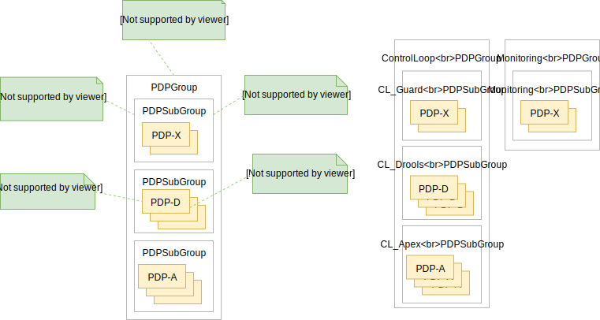

.. This work is licensed under a Creative Commons Attribution 4.0 International License.
.. http://creativecommons.org/licenses/by/4.0

.. _pap-label:

Policy Administration Point API
###############################

.. contents::
    :depth: 3

.. toctree::
   InternalPapPdp.rst

Policy Administration Point (PAP) Architecture
==============================================

The Policy Administration Point (PAP) keeps track of PDPs, supporting the deployment of PDP groups and the deployment
of policies across those PDP groups. Policies are created using the Policy API, but are deployed via the PAP.

The PAP is stateless in a RESTful sense, using the database (persistent storage) to track PDPs and the deployment of
policies to those PDPs. In short, policy management on PDPs is the responsibility of PAP; management of policies by
any other manner is not permitted.

Because the PDP is the main unit of scalability in the Policy Framework, the framework is designed to allow PDPs in a
PDP group to arbitrarily appear and disappear and for policy consistency across all PDPs in a PDP group to be easily
maintained. The PAP is responsible for controlling the state across the PDPs in a PDP group. The PAP interacts with the
policy database and transfers policies to PDPs.

The unit of execution and scaling in the Policy Framework is a *PolicyImpl* entity. A *PolicyImpl* entity runs on a PDP.
As is explained above, a *PolicyImpl* entity is a *PolicyTypeImpl* implementation parameterized with a TOSCA *Policy*.

In order to achieve horizontal scalability, we group the PDPs running instances of a given *PolicyImpl* entity logically
together into a *PDPSubGroup*. The number of PDPs in a *PDPSubGroup* can then be scaled up and down using Kubernetes. In
other words, all PDPs in a subgroup run the same *PolicyImpl*, that is the same policy template implementation (in
XACML, Drools, or APEX) with the same parameters.

The figure above shows the layout of *PDPGroup* and *PDPSubGroup* entities. The figure shows examples of PDP groups for
Control Loop and Monitoring policies on the right.

The health of PDPs is monitored by the PAP in order to alert operations teams managing policies. The PAP manages the life
cycle of policies running on PDPs.

The table below shows the deployment methods in which *PolicyImpl* entities can be deployed to PDP Subgroups.

========== =========================================== ============================== ==================================
**Method** **Description**                             **Advantages**                 **Disadvantages**
========== =========================================== ============================== ==================================
Cold       The *PolicyImpl* (*PolicyTypeImpl* and      No run time configuration      Very restrictive, no run time
           TOSCA *Policy*) are predeployed on the PDP. required and run time          configuration of PDPs is possible.
           PDP is fully configured and ready to        administration is simple.
           execute when started.

           PDPs register with the PAP when they
           start, providing the *pdpGroup* they
           have been preconfigured with.

Warm       The *PolicyTypeImpl* entity is predeployed  The configuration, parameters, Administration and management is
           on the PDP. A TOSCA *Policy* may be loaded  and PDP group of PDPs may be   required. The configuration and
           at startup. The PDP may be configured or    changed at run time by loading life cycle of the TOSCA policies
           reconfigured with a new or updated TOSCA    or updating a TOSCA *Policy*   can change at run time and must be
           *Policy* at run time.                       into the PDP.                  administered and managed.

           PDPs register with the PAP when they start, Support TOSCA *Policy* entity
           providing the *pdpGroup* they have been     life cycle managgement is
           predeployed with if any. The PAP may update supported, allowing features
           the TOSCA *Policy* on a PDP at any time     such as *PolicyImpl* Safe Mode
           after registration.                         and *PolicyImpl* retirement.

Hot        The *PolicyImpl* (*PolicyTypeImpl* and      The policy logic, rules,       Administration and management is
           TOSCA *Policy*) are deployed at run time.   configuration, parameters, and more complex. The *PolicyImpl*
           The *PolicyImpl* (*PolicyTypeImpl* and      PDP group of PDPs may be       itself and its configuration and
           TOSCA *Policy*) may be loaded at startup.   changed at run time by loading life cycle as well as the life
           The PDP may be configured or reconfigured   or updating a TOSCA *Policy*   cycle of the TOSCA policies can
           with a new or updated *PolicyTypeImpl*      and *PolicyTypeImpl* into the  change at run time and must be
           and/or TOSCA *Policy* at run time.          PDP.                           administered and managed.

           PDPs register with the PAP when they        Lifecycle management of TOSCA
           start, providing the *pdpGroup* they have   *Policy* entities and
           been preconfigured with if any. The PAP may *PolicyTypeImpl* entites is
           update the TOSCA *Policy* and               supported, allowing features
           *PolicyTypeImpl* on a PDP at any time after such as *PolicyImpl* Safe Mode
           registration                                and *PolicyImpl* retirement.
========== =========================================== ============================== ==================================

1 APIs
======
The APIs in the subchapters below are supported by the PAP.

1.1 REST API
------------

The purpose of this API is to support CRUD of PDP groups and subgroups and to support the deployment and life cycles of
policies on PDP sub groups and PDPs. This API is provided by the *PolicyAdministration* component (PAP) of the Policy
Framework, see the :ref:`ONAP Policy Framework Architecture <architecture-label>` page.

PDP groups and subgroups may be prefedined in the system. Predefined groups and subgroups may be modified or deleted
over this API. The policies running on predefined groups or subgroups as well as the instance counts and properties may
also be modified.

A PDP may be preconfigured with its PDP group, PDP subgroup, and policies. The PDP sends this information to the PAP
when it starts. If the PDP group, subgroup, or any policy is unknown to the PAP, the PAP locks the PDP in state PASSIVE.

PAP supports the operations listed in the following table, via its REST API:

.. csv-table::
   :header: "Operation", "Description"
   :widths: 25,70

   "Health check", "Queries the health of the PAP"
   "Consolidated healthcheck", "Queries the health of all policy components"
   "Statistics", "Queries various statistics"
   "PDP state change", "Changes the state of all PDPs in a PDP Group"
   "PDP Group create/update", "Creates/updates PDP Groups"
   "PDP Group delete", "Deletes a PDP Group"
   "PDP Group query", "Queries all PDP Groups"
   "Deployment update", "Deploy/undeploy one or more policies in specified PdpGroups"
   "Deploy policy", "Deploys one or more policies to the PDPs"
   "Undeploy policy", "Undeploys a policy from the PDPs"
   "Policy Status", "Queries the status of all policies"
   "Policy deployment status", "Queries the status of all deployed policies"
   "Policy Audit", "Queries the audit records of policies"

1.2 KAFKA API
-------------

PAP interacts with the PDPs via the kafka interface.  The messages listed
in the following table are transmitted via Kafka:

.. csv-table::
   :header: "Message", "Direction", "Description"
   :widths: 25,10,70

   "PDP status", "Incoming", "Registers a PDP with PAP; also sent as a periodic heart beat; also sent in response to requests from the PAP"
   "PDP update", "Outgoing", "Assigns a PDP to a PDP Group and Subgroup; also deploys or undeploys policies from the PDP"
   "PDP state change", "Outgoing", "Changes the state of a PDP or all PDPs within a PDP Group or Subgroup"

In addition, PAP generates notifications via the Kafka when policies are successfully or unsuccessfully
deployed (or undeployed) from all relevant PDPs.

Here is a sample notification:

.. literalinclude:: notification/kafka-pap-notif.json
    :language: json

2 PAP REST API Swagger
======================

It is worth noting that we use basic authorization for access with user name and password set to *policyadmin* and
*zb!XztG34*, respectively.

For every call, the client is encouraged to insert a uuid-type *requestID* as parameter. It is helpful for tracking each
http transaction and facilitates debugging. More importantly, it complies with Logging requirements v1.2. If the client
does not provide the requestID in a call, one will be randomly generated and attached to the response header,
*x-onap-requestid*.

In accordance with `ONAP API Common Versioning Strategy Guidelines
<https://wiki.onap.org/display/DW/ONAP+API+Common+Versioning+Strategy+%28CVS%29+Guidelines>`_, several custom headers
are added in the response to each call:

.. csv-table::
   :header: "Header", "Example value", "Description"
   :widths: 25,10,70

   "x-latestversion", "1.0.0", "latest version of the API"
   "x-minorversion", "0", "MINOR version of the API"
   "x-patchversion", "0", "PATCH version of the API"
   "x-onap-requestid", "e1763e61-9eef-4911-b952-1be1edd9812b", "described above; used for logging purposes"

.. csv-table::
   :header: "/healthcheck"
   :widths: 10

   `Health Check PAP Swagger <./local-swagger.html#tag/HealthCheckRestControllerV1>`_

This operation performs a health check on the PAP.

Here is a sample response:

.. literalinclude:: response/health-check-pap-resp.json
    :language: json

.. csv-table::
   :header: "/pdps/healthcheck"
   :widths: 10

   `Consolidated Health Check PAP Swagger <./local-swagger.html#tag/PolicyComponentsHealthCheckControllerV1>`_

This operation performs a health check of all policy components. The response
contains the health check result of each component. The consolidated health check
is reported as healthy only if all the components are healthy, otherwise the
"healthy" flag is marked as false.

Here is a sample response:

.. literalinclude:: response/consolidated-healthcheck-pap-resp.json
    :language: json

.. csv-table::
   :header: "/pdps/groups/{name}"
   :widths: 10

   `PDP State Change PAP Swagger <./local-swagger.html#tag/PdpGroupStateChangeControllerV1>`_

The state of PDP groups is managed by this operation. PDP groups can be in states PASSIVE, TEST, SAFE, or ACTIVE. For a full
description of PDP group states, see the :ref:`ONAP Policy Framework Architecture <architecture-label>` page.

.. csv-table::
   :header: "/pdps/groups/batch"
   :widths: 10

   `Group Batch PAP Swagger <./local-swagger.html#tag/PdpGroupCreateOrUpdateControllerV1>`_

This operation allows the PDP groups and subgroups to be created and updated. Many PDP groups can be created or updated
in a single POST operation by specifying more than one PDP group in the POST operation body.
This can be used to create the PDP group by providing all the details including the supported policy types for each subgroup.
However, it cannot be used to update policies; that is done using one of
the deployment requests.  Consequently, the "policies" property of this
request will be ignored.
This can also be used to update a PDP Group, but supported policy types cannot be updated during the update operation.
So, "policies" and "supportedPolicyTypes" properties in the request will be ignored if provided during the PDP Group update operation.

The "desiredInstanceCount" specifies the minimum number of PDPs of the given
type that should be registered with PAP.  Currently, this is just used for
health check purposes; if the number of PDPs registered with PAP drops below
the given value, then PAP will return an "unhealthy" indicator if a
"Consolidated Health Check" is performed.

.. note::
  If a subgroup is to be deleted from a PDP Group, then the policies must be removed from
  the subgroup first.

.. note::
  Policies cannot be added/updated during PDP Group create/update operations. So, if provided, they are ignored.
  Supported policy types are defined during PDP Group creation. They cannot be updated once they are created.
  So, supportedPolicyTypes are expected during PDP Group create, but ignored if provided during PDP Group update.

Here is a sample request:

.. literalinclude:: request/groups-batch-pap-req.json
    :language: json

.. csv-table::
   :header: "/pdps/groups/{name}"
   :widths: 10

   `PdpGroup Delete PAP Swagger <./local-swagger.html#tag/PdpGroupDeleteControllerV1>`_

The API also allows PDP groups to be deleted. DELETE operations are only permitted on PDP groups in PASSIVE state.

.. csv-table::
   :header: "/pdps"
   :widths: 10

   `PdpGroup Query PAP Swagger <./local-swagger.html#tag/PdpGroupQueryControllerV1>`_

This operation allows the PDP groups and subgroups to be listed as well as the policies that are deployed on each PDP
group and subgroup.

Here is a sample response:

.. literalinclude:: response/group-query-pap-resp.json
    :language: json

.. csv-table::
   :header: "/pdps/deployments/batch"
   :widths: 10

   `Deployments Update PAP Swagger <./local-swagger.html#tag/PdpGroupDeployControllerV1>`_

This operation allows policies to be deployed on specific PDP groups.
Each subgroup includes an "action" property, which is used to indicate
that the policies are being added (POST) to the subgroup, deleted (DELETE)
from the subgroup, or that the subgroup's entire set of policies is being
replaced (PATCH) by a new set of policies.  As such, a subgroup may appear
more than once in a single request, one time to delete some policies and
another time to add new policies to the same subgroup.

Here is a sample request:

.. literalinclude:: request/deployment-batch-pap-req.json
    :language: json

Here is a sample response:

.. literalinclude:: response/deployment-pap-resp.json
    :language: json

.. csv-table::
   :header: "/pdps/policies"
   :widths: 10

   `Deploy PAP Swagger <./local-swagger.html#operation/deployPolicies>`_

This operation allows policies to be deployed across all relevant PDP groups.
PAP will deploy the specified policies to all relevant subgroups.  Only the
policies supported by a given subgroup will be deployed to that subgroup.

.. note::
  The policy version is optional.  If left unspecified, then the latest version of the policy is deployed. On the other
  hand, if it is specified, it may be an integer, or it may be a fully qualified version (e.g., "3.0.2").
  In addition, a subgroup to which a policy is being deployed must have at
  least one PDP instance, otherwise the request will be rejected.

Here is a sample request:

.. literalinclude:: request/policy-deploy-pap-req.json
    :language: json

Here is a sample response:

.. literalinclude:: response/deployment-pap-resp.json
    :language: json

.. csv-table::
   :header: "/pdps/policies/{name}"
   :widths: 10

   `Undeploy PAP Swagger <./local-swagger.html#operation/deletePolicy>`_

This operation allows policies to be undeployed from PDP groups.

.. note::
  If the policy version is specified, then it may be an integer, or it may be a fully qualified version (e.g., "3.0.2").
  On the other hand, if left unspecified, then the latest deployed version will be undeployed.

.. note::
  Due to current limitations, a fully qualified policy version must always be specified.

Here is a sample response:

.. literalinclude:: response/deployment-pap-resp.json
    :language: json

.. csv-table::
   :header: "/policies/status"
   :widths: 10

   `All Policy Status PAP Swagger <./local-swagger.html#operation/getStatusOfAllPolicies>`_

This operation allows the status of all policies that are deployed or undeployed to be listed together.
The result can be filtered based on pdp group name, policy name & version.

.. note::
  When a policy is successfully undeployed, it will no longer appear in the policy status response.

Here is a sample response:

.. literalinclude:: response/policy-status-pap-resp.json
    :language: json

.. csv-table::
   :header: "/policies/deployed"
   :widths: 10

   `Deployed Policy Status PAP Swagger <./local-swagger.html#operation/queryAllDeployedPolicies>`_

This operation allows the deployed policies to be listed together with their respective deployment status.
The result can be filtered based on policy name & version.

Here is a sample response:

.. literalinclude:: response/deployed-policy-pap-resp.json
    :language: json

.. csv-table::
   :header: "/policies/audit"
   :widths: 10

   `Policy Status PAP Swagger <./local-swagger.html#tag/PolicyAuditControllerV1>`_

This operation allows the audit records of policies to be listed together.
The result can be filtered based on pdp group name, policy name & version.
Along with record count, start time & end time as query parameters.

Here is a sample response:

.. literalinclude:: response/policy-audit-pap-resp.json
    :language: json

3 Configuration
=================

The *PolicyAdministration* component (PAP) is initialized using a configuration file: `papParameters.yaml
<https://github.com/onap/policy-pap/blob/master/packages/policy-pap-tarball/src/main/resources/etc/papParameters.yaml>`_

The configuration file is a YAML file containing the relevant fields for configuring the REST server, Database and Kafka connectivity and so on.

End of Document
