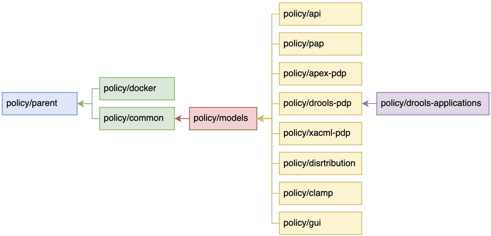

.. This work is licensed under a  Creative Commons Attribution
.. 4.0 International License.
.. http://creativecommons.org/licenses/by/4.0

Using Policy Release scripts to make Policy Framework releases
##############################################################

This page describes how to make a release of the Policy Framework using the Policy Framework release scripts. the
scripts are available `in Github here <https://github.com/onap/policy-parent/tree/master/integration/src/release_scripts>`_.

The release scripts generate a data file that keeps track of the status of each repo as the release proceeds. The
scripts use the data in the data file to automatically generate artifacts and commits for the releases process.

.. warning::
  The release scripts are an aid in the releae process and do help to apeed upthe work of doing a release. However they
  do NOT automate the release process, a high degree of manual work and supervision is still required to do a release.

The Scripts
===========

The following scripts are provided:

.. list-table::
   :widths: 15 85
   :header-rows: 1

   * - Script
     - Description
   * - bumpSnapshots.sh
     - generate commits to bump the snapshot version and update references to snapshot references on any repos that
       need to be bumped or updated based on the data in the release data file
   * - generateCommit.sh
     - generates a new commit or a patch on an existing commit on repositories, it is called when another script has
       updated a repository
   * - getReleaseData.sh
     - gets and updates information from the checked out Policy Framework repos for the release process
   * - mkart.sh
     - creates the artifact release yaml file for a release in the "releases" directory
   * - mkdock.sh
     - creates the docker release yaml file for a release in the "releases" directory
   * - releasePhase.sh
     - generates the commits to perform a given phase of the Policy Framework release process
   * - releaseRepo.sh
     - release the specified repository by generating the release yaml file and the release commit, calls "mkArt.sh" and
       "generateCommit.sh" to release the repo
   * - releaseRepoImages.sh
     - release the docker images for the specified repository by generating the release yaml file and the release"
       commit, calls "mkDock.sh" and "generateCommit.sh" to release the images
   * - updateOomImages.sh
     - generate an OOM commit to update the versions of Policy Framework images in values.yaml files
   * - updateParentRef.sh
     - update the parent reference in a POM file
   * - updateRefs.sh
     - updates the inter-repo references in Policy Framework POM files

The scripts have been verified to work on Ubuntu 20.04.3 and on MacOS Monterey 12.0.1.

.. note::
    On MacOS, GNU sed must be used. Download the 'gsed' command using homebrew

Prerequisites
=============

Set up the release scripts for use
----------------------------------

#. Check out the Policy Framework parent repo from the ONAP gerrit:
   `https://gerrit.onap.org/r/admin/repos/policy/parent <https://gerrit.onap.org/r/admin/repos/policy/parent>`_.

#. Add the *<path_to_policy_parent>/integration/src/release_scripts* directory to your PATH

Check out a clean copy of the Policy Framework repos
----------------------------------------------------

Check out the Policy Framework repos into a directory into the structure below:

.. code-block::

    <path_to_repos>/policy/parent
    <path_to_repos>/policy/docker
    <path_to_repos>/policy/common
    <path_to_repos>/policy/models
    <path_to_repos>/policy/api
    <path_to_repos>/policy/pap
    <path_to_repos>/policy/apex-pdp
    <path_to_repos>/policy/drools-pdp
    <path_to_repos>/policy/xacml-pdp
    <path_to_repos>/policy/distribution
    <path_to_repos>/policy/clamp
    <path_to_repos>/policy/gui
    <path_to_repos>/policy/drools-applications

A script such as that described in the **Cloning All The Policy Repositories** section of the
:ref:`policy-development-tools-label` page can be used to automatically clone the repos.

Common Arguments to Scripts
===========================

The scripts take certain arguments and arguments are common over scripts

.. list-table::
   :widths: 20 80
   :header-rows: 1

   * - Argument
     - Description
   * - -d data-file
     - the policy release data file to create, defaults to './pf_release_data.csv'
   * - -h
     - Print help for the script
   * - -i issue-id
     - JIRA issue ID in the format POLICY-nnnn
   * - -l location
     - the location of the policy framework repos on the file system, defaults to './'
   * - -r repo
     - the policy repo to which to commit, such as 'policy/distribtuion'

Build the release data file
===========================

Run the *getReleaseData.sh* script to build the release data file.

.. code-block::

    getReleaseData.sh -l policy_repo_location -d work_location/pf_release_data.csv

The command above examines the Policy Framework repositories in the directory *policy_repo_location* and creates a CSV
file called pf_release_data.csv in the directory *work_location*.

The contents of the data file is similar to the structure below:

.. list-table::
   :widths: 10 7 10 7 66
   :header-rows: 1

   * - Repo
     - Last Tag Version
     - Master Snapshot Version
     - Changed Files
     - Docker Images
   * - policy/parent
     - 3.5.0
     - 3.5.1-SNAPSHOT
     - 10
     -
   * - policy/docker
     - 2.4.0
     - 2.4.1-SNAPSHOT
     - 4
     - 'policy-jre-alpine':'policy-jdk-alpine':'policy-db-migrator'
   * - policy/common
     - 1.10.0
     - 1.10.1-SNAPSHOT
     - 0
     -
   * - policy/models
     - 2.6.0
     - 2.6.1-SNAPSHOT
     - 0
     -
   * - policy/api
     - 2.6.0
     - 2.6.1-SNAPSHOT
     - 0
     - 'policy-api'
   * - policy/pap
     - 2.6.0
     - 2.6.1-SNAPSHOT
     - 66
     - 'policy-pap'
   * - policy/apex-pdp
     - 2.7.0
     - 2.7.1-SNAPSHOT
     - 3
     - 'policy-apex-pdp'
   * - policy/drools-pdp
     - 1.10.0
     - 1.10.1-SNAPSHOT
     - 0
     - 'policy-drools'
   * - policy/xacml-pdp
     - 2.6.0
     - 2.6.1-SNAPSHOT
     - 0
     - 'policy-xacml-pdp'
   * - policy/distribution
     - 2.7.0
     - 2.7.1-SNAPSHOT
     - 25
     - 'policy-distribution'
   * - policy/clamp
     - 6.2.0
     - 6.2.1-SNAPSHOT
     - 23
     - 'policy-clamp-backend':'policy-clamp-frontend':'policy-clamp-cl-pf-ppnt':'policy-clamp-cl-k8s-ppnt':'policy-clamp-cl-http-ppnt':'policy-clamp-cl-runtime'
   * - policy/gui
     - 2.2.0
     - 2.2.1-SNAPSHOT
     - 16
     - 'policy-gui'
   * - policy/drools-applications
     - 1.10.0
     - 1.10.1-SNAPSHOT
     - 0
     - 'policy-pdpd-cl'

The columns in the data file are described below.

.. list-table::
   :widths: 20 80
   :header-rows: 1

   * - Column
     - Description
   * - Repo
     - the policy framework repo
   * - Last Tag Version
     - the last version of the repo that has been released
   * - Master Snapshot Version
     - the current snapshot version of the repo
   * - Changed Files
     - the number of changed files on the snapshot version since the last release
   * - Docker Images
     - the docker images that are released from the repo as a ':'  delimited list

When you run the *getReleaseData.sh* script, it updates the current status of the release to the release data file. You
will run this script many times during the release process as commits are merged and as the current status changes.

Doing a Release
===============

There are a number of phases in doing a release of the Policy Framework, which must be performed in the correct order.

Each phase roughly follows the steps below:

#. Run the *getReleaseData.sh* script to update the local release data CSV file
#. Run the *releasePhase.sh* script to create the artifacts and generate the commits for a phase
#. Use gerrit to drive the generated commits through the normal ONAP review process until the commits are merged
#. Move onto the next phase

The diagram above shows the dependency order of Policy Framework repos. Therefore, in the release process, the phases
release the repos in order moving from left to right, staring with *policy/parent* and finishing with
*policy/drools-applications*.

The table below gives details of each phase in the release process. The *-l*, *-d*, and *-i* arguments on the
*releasePhase.sh* script are omitted for brevity. Please specify those arguments to suit your local work setup.

+-------+----------------------+-------------------------------------------------------------------------+
| Phase | Steps                | Description                                                             |
+-------+----------------------+-------------------------------------------------------------------------+
| 1     | getReleaseData.sh    | Update parent references in the parent pom.xml, submit commit to git,   |
|       +----------------------+ and get the commit merged.                                              |
|       | releasePhase.sh -p 1 |                                                                         |
+-------+----------------------+-------------------------------------------------------------------------+
| 2     | stage-release        | In Gerrit, run the *stage-release* magic word on the merged commit      |
|       +----------------------+ created in phase 1. Then update your local data. Create the artifact    |
|       | getReleaseData.sh    | artifact release yaml file in the *releases* directory, and submit the  |
|       +----------------------+ commit to git. Then get the commit merged.                              |
|       | releasePhase.sh -p 2 |                                                                         |
+-------+----------------------+-------------------------------------------------------------------------+

End of Document
