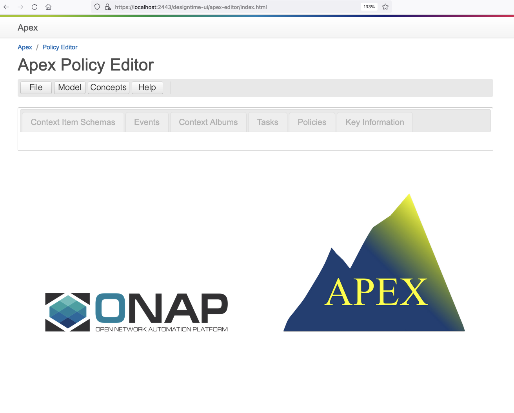

.. This work is licensed under a Creative Commons Attribution 4.0 International License.

.. _apex-policy-editor-label:

The Policy Framework Apex Policy Editor
#######################################

.. contents::
    :depth: 4

The Apex Policy Editor allows a user to create and edit an Apex policy. It's UI is shown in the image below.

See the :ref:`My-First-Policy Example <apex-myFirstExample>` for an example of using the Apex policy editor.

