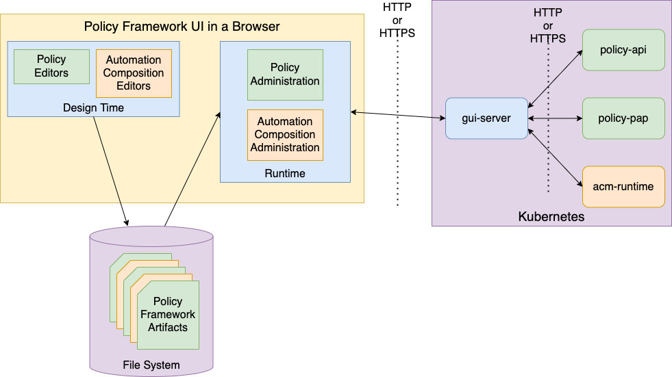
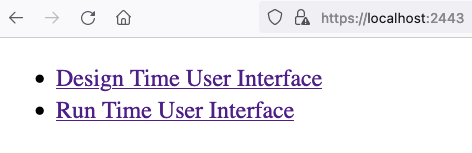

.. This work is licensed under a Creative Commons Attribution 4.0 International License.

.. _ui-label:

The Policy Framework User Interfaces
####################################

The Policy Framework has a demonstration user interface that supports design time and runtime activities for the Policy
Framework.

Design time activities are offline activities such as policy editing and ACM composition preparation. The design time UI
works with offline files, producing artifacts that can be consumed by the runtime Policy Framework APIs.

Runtime operations include creating and updating policy types and policies, deploying policies as well as working with
Automation Compositions. The runtime UI works towards the REST APIs published by the Policy Framework.

.. note::
   The policy framework UI is developed for use in demonstrations. It is a work in progress. As such, it does not cover
   all the features and functions that are avaiable on the Policy Framework REST APIs.

A Policy Framework installation in Kubernetes is shown in the figure above. The **policy-api**, **policy-pap** and
**acm-runtime** microservices publish REST interfaces. In a Service Mesh installation, these interfaces are exposed
over HTTP and are available inside the Service Mesh. Alternatively, the interfaces may be exposed publicly over HTTPS.

The **gui-server** microservice serves the GUI code to the browser for Policy Framework UI. In addition, it acts as
a single point of reference for the REST interfaces provided by **policy-api**, **policy-pap**, and **acm-runtime**.
It can also be used as a HTTPS gatewy for REST references into a Policy Framework deployment in a Kubernetes cluster.

The Policy Framework UI runs in a browser as a Web application. It has a **designtime** and a **runtime** part.

The Policy Framework main UI is shown in the image above. It is, at present, a plain HTML page.

The pages below describe the elements of the Policy Framework UI.

.. toctree::
   :maxdepth: 4

   designtime-ui/designtime-ui
   runtime-ui/runtime-ui
