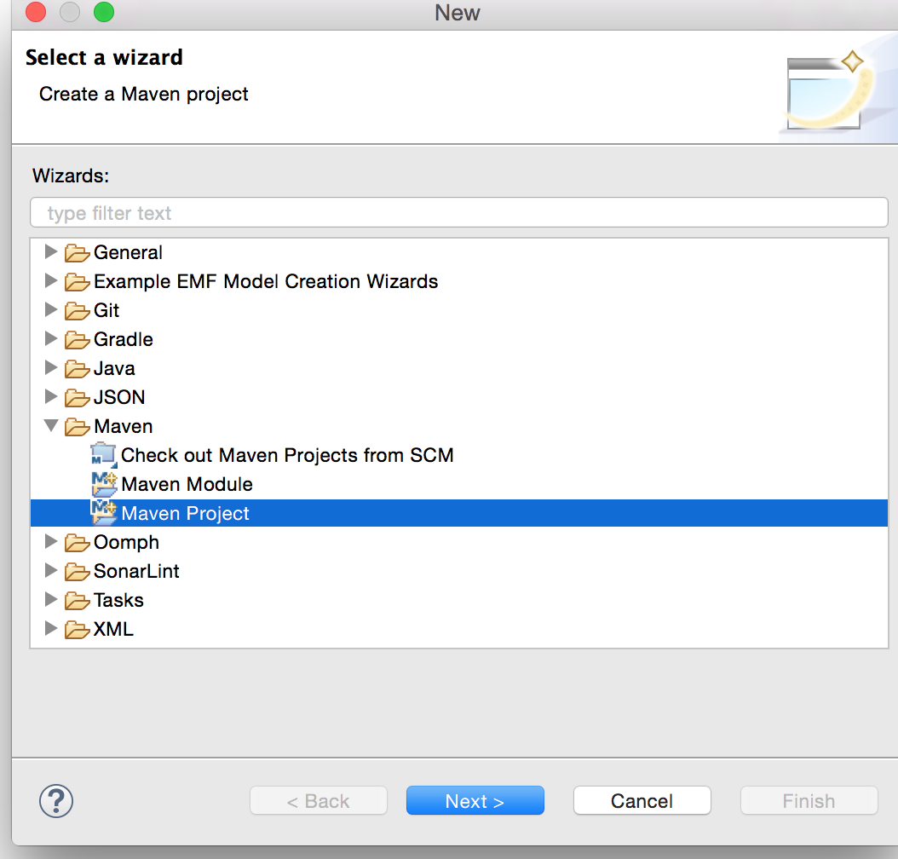
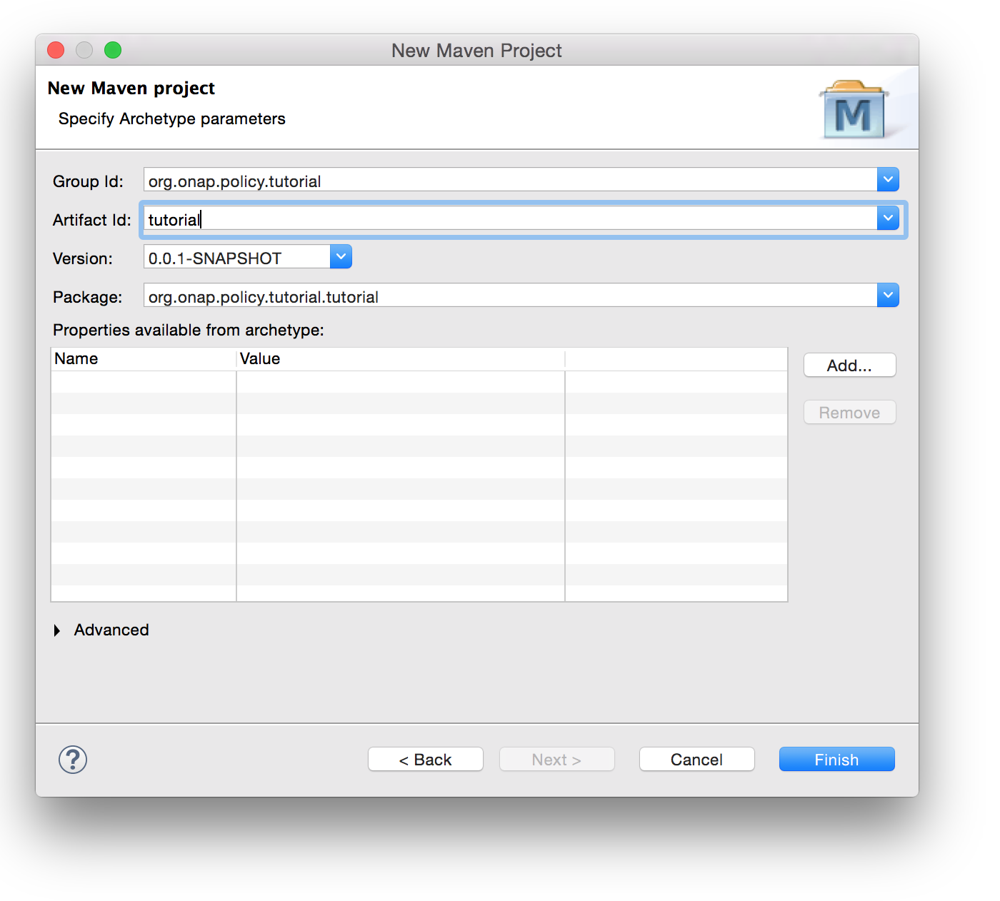
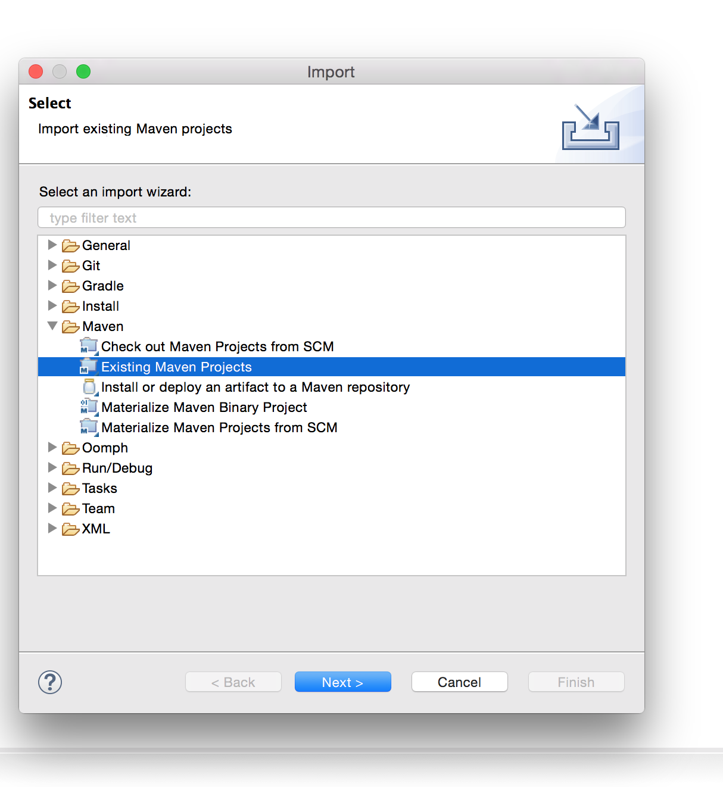
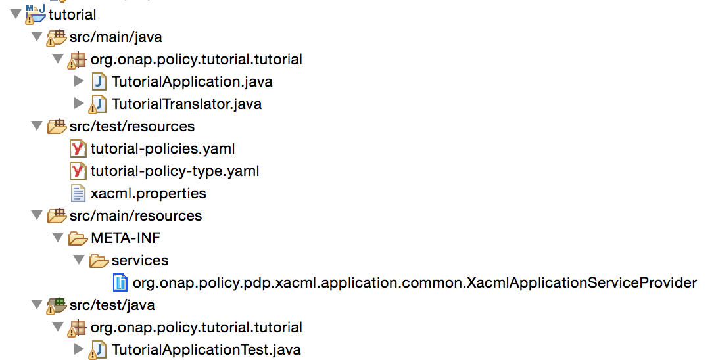
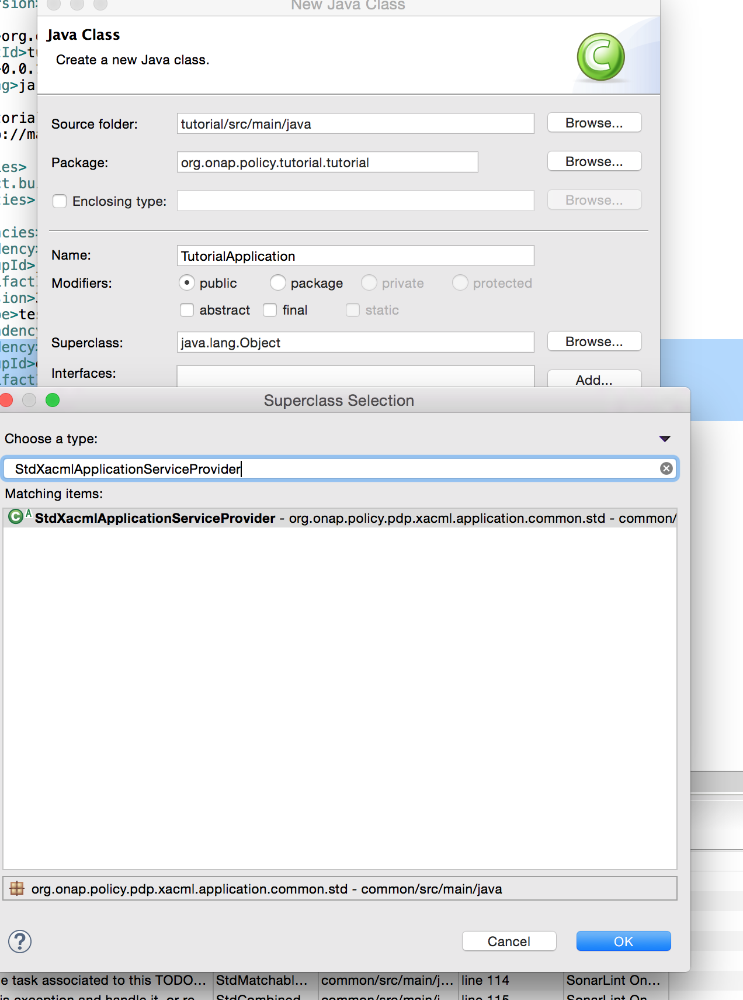

.. This work is licensed under a Creative Commons Attribution 4.0 International License.

.. _xacmltutorial-label:

Policy XACML - Custom Application Tutorial
##########################################

.. toctree::
   :maxdepth: 3

This tutorial shows how to build a XACML application for a Policy Type. Please be sure to clone the
policy repositories before going through the tutorial. See :ref:`policy-development-tools-label` for details.

Design a Policy Type
********************
Follow :ref:`TOSCA Policy Primer <tosca-label>` for more information. For the tutorial, we will use
this example Policy Type in which an ONAP PEP client would like to enforce an action **authorize**
for a *user* to execute a *permission* on an *entity*.

.. literalinclude:: tutorial/app/src/test/resources/tutorial-policy-type.yaml
  :language: yaml
  :caption: Example Tutorial Policy Type
  :linenos:

We would expect then to be able to create the following policies to allow the demo user to Read/Write
an entity called foo, while the audit user can only read the entity called foo. Neither user has Delete
permission.

.. literalinclude:: tutorial/app/src/test/resources/tutorial-policies.yaml
  :language: yaml
  :caption: Example Policies Derived From Tutorial Policy Type
  :linenos:

Design Decision Request and expected Decision Response
******************************************************
For the PEP (Policy Enforcement Point) client applications that call the Decision API, you need
to design how the Decision API Request resource fields will be sent via the PEP.

.. literalinclude:: tutorial/app/src/test/resources/tutorial-decision-request.json
  :language: JSON
  :caption: Example Decision Request
  :linenos:

For simplicity, this tutorial expects only a *Permit* or *Deny* in the Decision Response. However, one could
customize the Decision Response object and send back whatever information is desired.

.. literalinclude:: tutorial/tutorial-decision-response.json
  :language: JSON
  :caption: Example Decision Response
  :linenos:

Create A Maven Project
**********************
This part of the tutorial assumes you understand how to use Eclipse to create a Maven
project. Please follow any examples for the Eclipse installation you have to create
an empty application. For the tutorial, use groupId *org.onap.policy.tutorial* and artifactId
*tutorial*. If you wish to go directly to the source code, please see the
:ref:`Download Tutorial Application Example` below to download it.

Be sure to import the policy/xacml-pdp project into Eclipse.

Add Dependencies Into Application pom.xml
*****************************************

Here we import the XACML PDP Application common dependency which has the interfaces we need to implement. In addition,
we are importing a testing dependency that has common code for producing a JUnit test.

.. code-block:: java
  :caption: pom.xml dependencies

    <dependency>
      <groupId>org.onap.policy.xacml-pdp.applications</groupId>
      <artifactId>common</artifactId>
      <version>2.2.2</version>
    </dependency>
    <dependency>
      <groupId>org.onap.policy.xacml-pdp</groupId>
      <artifactId>xacml-test</artifactId>
      <version>2.2.2</version>
      <scope>test</scope>
    </dependency>

Create META-INF to expose Java Service
**************************************
The ONAP XACML PDP Engine will not be able to find the tutorial application unless it has
a property file located in src/main/resources/META-INF/services that contains a property file
declaring the class that implements the service.

The name of the file must match **org.onap.policy.pdp.xacml.application.common.XacmlApplicationServiceProvider**
and the contents of the file is one line **org.onap.policy.tutorial.tutorial.TutorialApplication**.

Create A Java Class That Extends **StdXacmlApplicationServiceProvider**
***********************************************************************
You could implement **XacmlApplicationServiceProvider** if you wish, but
for simplicity if you just extend **StdXacmlApplicationServiceProvider** you
will get a lot of implementation done for your application up front. All
that needs to be implemented is providing a custom translator.

.. code-block:: java
  :caption: Custom Tutorial Application Service Provider
  :emphasize-lines: 6

  package org.onap.policy.tutorial.tutorial;

  import org.onap.policy.pdp.xacml.application.common.ToscaPolicyTranslator;
  import org.onap.policy.pdp.xacml.application.common.std.StdXacmlApplicationServiceProvider;

  public class TutorialApplication extends StdXacmlApplicationServiceProvider {

        @Override
        protected ToscaPolicyTranslator getTranslator(String type) {
                // TODO Auto-generated method stub
                return null;
        }

  }

Override Methods for Tutorial
*****************************
Override these methods to differentiate Tutorial from other applications so that the XACML PDP
Engine can determine how to route policy types and policies to the application.

.. code-block:: java
  :caption: Custom Tutorial Application Service Provider

  package org.onap.policy.tutorial.tutorial;

  import java.util.Arrays;
  import java.util.List;

  import org.onap.policy.models.tosca.authorative.concepts.ToscaPolicyTypeIdentifier;
  import org.onap.policy.pdp.xacml.application.common.ToscaPolicyTranslator;
  import org.onap.policy.pdp.xacml.application.common.std.StdXacmlApplicationServiceProvider;

  public class TutorialApplication extends StdXacmlApplicationServiceProvider {
	
    private final ToscaPolicyTypeIdentifier supportedPolicyType = new ToscaPolicyTypeIdentifier();

    @Override
    public String applicationName() {
        return "tutorial";
    }

    @Override
    public List<String> actionDecisionsSupported() {
        return Arrays.asList("authorize");
    }

    @Override
    public synchronized List<ToscaPolicyTypeIdentifier> supportedPolicyTypes() {
        return Arrays.asList(supportedPolicyType);
    }

    @Override
    public boolean canSupportPolicyType(ToscaPolicyTypeIdentifier policyTypeId) {
    	return supportedPolicyType.equals(policyTypeId);
    }

    @Override
        protected ToscaPolicyTranslator getTranslator(String type) {
        // TODO Auto-generated method stub
        return null;
    }

  }

Create A Translation Class that extends the ToscaPolicyTranslator Class
***********************************************************************
Please be sure to review the existing translators in the policy/xacml-pdp repo to see if they could
be re-used for your policy type. For the tutorial, we will create our own translator.

The custom translator is not only responsible for translating Policies derived from the Tutorial
Policy Type, but also for translating Decision API Requests/Responses to/from the appropriate XACML
requests/response objects the XACML engine understands.  

.. code-block:: java
  :caption: Custom Tutorial Translator Class

  package org.onap.policy.tutorial.tutorial;

  import org.onap.policy.models.decisions.concepts.DecisionRequest;
  import org.onap.policy.models.decisions.concepts.DecisionResponse;
  import org.onap.policy.models.tosca.authorative.concepts.ToscaPolicy;
  import org.onap.policy.pdp.xacml.application.common.ToscaPolicyConversionException;
  import org.onap.policy.pdp.xacml.application.common.ToscaPolicyTranslator;

  import com.att.research.xacml.api.Request;
  import com.att.research.xacml.api.Response;

  import oasis.names.tc.xacml._3_0.core.schema.wd_17.PolicyType;

  public class TutorialTranslator implements ToscaPolicyTranslator {

    public PolicyType convertPolicy(ToscaPolicy toscaPolicy) throws ToscaPolicyConversionException {
        // TODO Auto-generated method stub
        return null;
    }

    public Request convertRequest(DecisionRequest request) {
        // TODO Auto-generated method stub
        return null;
    }

    public DecisionResponse convertResponse(Response xacmlResponse) {
        // TODO Auto-generated method stub
        return null;
    }

  }

Implement the TutorialTranslator Methods
****************************************
This is the part where knowledge of the XACML OASIS 3.0 specification is required. Please refer to
that specification on the many ways to design a XACML Policy.

For the tutorial, we will build code that translates the TOSCA Policy into one XACML Policy that matches
on the user and action. It will then have one or more rules for each entity and permission combination. The
default combining algorithm for the XACML Rules are to "Deny Unless Permit".

.. Note::
  There are many ways to build the policy based on the attributes. How to do so is a matter of experience and
  fine tuning using the many options for combining algorithms, target and/or condition matching and the rich set of
  functions available.

Here is one implementation example:

.. literalinclude:: tutorial/app/src/main/java/org/onap/policy/tutorial/tutorial/TutorialTranslator.java
  :caption: Example Translator Implementation
  :linenos:

Use the TutorialTranslator in the TutorialApplication
*****************************************************
Be sure to go back to the TutorialApplication and create an instance of the translator to return to the
StdXacmlApplicationServiceProvider. The StdXacmlApplicationServiceProvider uses the translator to convert
a policy when a new policy is deployed to the ONAP XACML PDP Engine.

.. code-block:: java
  :caption: Final TutorialApplication Class
  :linenos:
  :emphasize-lines: 37

  package org.onap.policy.tutorial.tutorial;

  import java.util.Arrays;
  import java.util.List;

  import org.onap.policy.models.tosca.authorative.concepts.ToscaPolicyTypeIdentifier;
  import org.onap.policy.pdp.xacml.application.common.ToscaPolicyTranslator;
  import org.onap.policy.pdp.xacml.application.common.std.StdXacmlApplicationServiceProvider;

  public class TutorialApplication extends StdXacmlApplicationServiceProvider {
	
    private final ToscaPolicyTypeIdentifier supportedPolicyType = new ToscaPolicyTypeIdentifier();
    private final TutorialTranslator translator = new TutorialTranslator();

    @Override
    public String applicationName() {
        return "tutorial";
    }

    @Override
    public List<String> actionDecisionsSupported() {
        return Arrays.asList("authorize");
    }

    @Override
    public synchronized List<ToscaPolicyTypeIdentifier> supportedPolicyTypes() {
        return Arrays.asList(supportedPolicyType);
    }

    @Override
    public boolean canSupportPolicyType(ToscaPolicyTypeIdentifier policyTypeId) {
    	return supportedPolicyType.equals(policyTypeId);
    }

    @Override
    protected ToscaPolicyTranslator getTranslator(String type) {
        return translator;
     }

  }

Create a XACML Request from ONAP Decision Request
*************************************************
The easiest way to do this is to use the annotations feature from XACML PDP library to create an example XACML
request. Then create an instance and simply populate it from an incoming ONAP Decision Request.

.. image: tutorial/images/eclipse-create-request.png

.. literalinclude:: tutorial/app/src/main/java/org/onap/policy/tutorial/tutorial/TutorialRequest.java
  :caption: Example Decision Request to Decision Response Implementation
  :linenos:

Create xacml.properties for the XACML PDP engine to use
*******************************************************
In the applications *src/test/resources* directory, create a xacml.properties file that will be used by the embedded
XACML PDP Engine when loading.

.. literalinclude:: tutorial/app/src/test/resources/xacml.properties
  :caption: Example xacml.properties file
  :linenos:
  :emphasize-lines: 20, 25

Create a JUnit and use the TestUtils.java class in xacml-test dependency
************************************************************************
Using Eclipse, create a JUnit and be sure to add a setup() method stub. Here you will be utilizing a TestUtils.java
class from the policy/xamcl-pdp repo's xacml-test submodule to use some utility methods for building the JUnit test.

.. image: tutorial/images/eclipse-junit-create.png

Copy the TOSCA Policy Type :download:`link <tutorial/app/src/test/resources/tutorial-policy-type.yaml>` and the TOSCA Policies :download:`link <tutorial/app/src/test/resources/tutorial-policies.yaml>`
into the src/test/resources directory.

We will create a temporary folder which is used by the **StdXacmlApplicationServiceProvider** to store working copies of policies as they are loaded
into the application.

.. literalinclude:: tutorial/app/src/test/java/org/onap/policy/tutorial/tutorial/TutorialApplicationTest.java
  :caption: Example Translator Implementation
  :linenos:

Run the JUnit test. Its easiest to run it via a terminal command line using maven commands.

.. code-block:: bash
   :caption: Running Maven Commands
   :linenos:

   > mvn clean install

Building Docker Image
*********************
Once you have created enough JUnit tests that test the TutorialTranslator.java and TutorialRequest.java classes, you are ready to now make your
application build a docker image that incorporates your application with the XACML PDP Engine. The XACML PDP Engine
must be able to *find* your Java.Service in the classpath. This is easy to do, just create a jar file for your application
and copy into the same directory used to startup the XACML PDP.

Here is a Dockerfile as an example:

.. literalinclude:: tutorial/app/src/main/docker/Dockerfile
  :caption: Dockerfile
  :linenos:

Download Tutorial Application Example
*************************************

If you don't wish to use Eclipse, or go through the steps outlines above. The tutorial is
available for download:

:download:`Download tutorial tar <tutorial/tutorial.tar>`

After you tar xf tutorial.jar, you can import it into Eclipse or your favorite editor. Or simply
use a terminal command line to build, test and run the tutorial.
